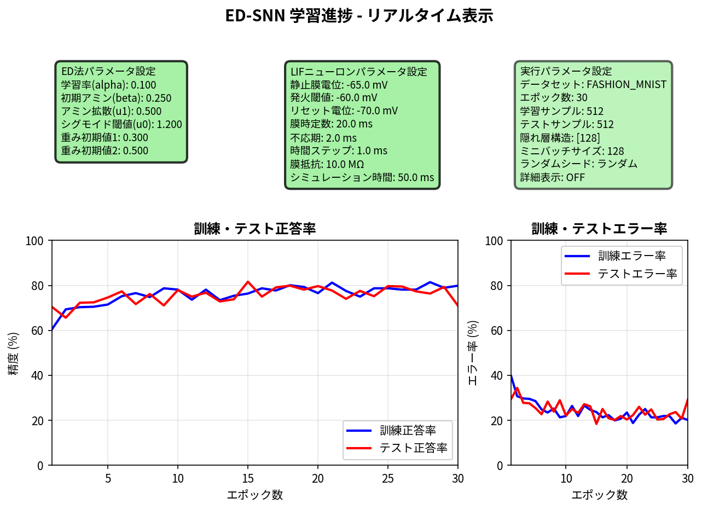

# ED-Multi SNN - スパイキングニューラルネットワークのための純粋ED法実装

金子勇氏オリジナルError-Diffusion（ED）法をスパイキングニューラルネットワーク（SNN）に適用した実装です。<br>
本実装では、**3つの異なるバージョン**を用意しています。
 1. ed_multi_lif_snn.py         100％のLIFニューロンで構成されるネットワーク
 2. ed_multi_lif_snn_simple.py  基本的な機能のみの実装にしたネットワーク
 3. ed_mulit_frelu_snn.py       活性化関数にFReLUを用いたネットワーク

## ED法の詳細

ED法(Error-Diffusion法)とは、故金子勇氏が1999年に考案された、「微分の連鎖律を用いた誤差逆伝播法」を用いない生物学的に妥当な多層ニューラルネットワークの学習方法です。<br>
ED法の詳細については、[ED法_解説資料.md](docs/ED法_解説資料.md)をご覧ください。

## 概要

本実装は、生物学的な妥当性が低い「微分の連鎖律を用いた誤差逆伝播法」を使用せず、金子勇氏が考案された生物学的な妥当性の高い「ED法」による学習アルゴリズムを用いてMNISTとFashion-MNISTの画像分類を実現します。<br>
なお、本実装ではすべてのニューロンがLIFニューロンで構成されている、完全なスパイキングニューラルネットワークをベースとしています。

## 学習結果の可視化

各バージョンでの実際の学習進捗をリアルタイム表示したグラフです。青線が学習精度、オレンジ線がテスト精度を示しています。

### 🧠 LIF版（完全SNN）学習結果


**最高成績**: Fashion-MNIST テスト正答率 **80.83%** (学習精度: 81.27%)  
設定: 隠れ層4096,128,128ニューロン, 30エポック, シード42

### 📚 Simple版（実装学習用）学習結果



**教育用実装**: 基本的なED法+SNNの学習過程を理解しやすく可視化  
設定: 30エポック学習での進捗グラフ

### 🚀 FReLU版（実装試験用）学習結果


**実験的実装**: FReLU活性化関数とED法の組み合わせ検証  
設定: 隠れ層4096,128ニューロン, 20エポック（実行中のため暫定表示）

## 試行例(参考)

実際の学習試行の詳細な記録とパラメータ設定の参考例を提供しています。

### 📊 LIF版学習試行記録

[**lif_snn_learning_test_results.md**](test_results/lif_snn_learning_test_results.md)

- **完全LIF版の学習結果**: Fashion-MNIST データセットでの複数試行記録
- **最高達成正答率**: 80.83% (隠れ層4096,128,128ニューロン, 30エポック)
- **パラメータ調整例**: 学習率、アミン濃度、隠れ層構造の試行錯誤過程
- **実行設定詳細**: 各試行でのコマンドライン引数と結果の対応関係

### 🚀 FReLU版学習試行記録

[**frelu_snn_learning_test_results.md**](test_results/frelu_snn_learning_test_results.md)

- **FReLU版の実験結果**: ED法とFReLU活性化関数の組み合わせ検証
- **ハイブリッド構成**: 入力層LIF + 隠れ層・出力層FReLUの性能評価
- **最適化実験**: 異なるパラメータでの性能比較と考察
- **実装特性**: FReLU版特有の設定と動作特性の記録

これらの試行記録は、実際にシステムを使用する際のパラメータ選択やトラブルシューティングの参考として活用できます。

## 提供バージョン

### 🧠 LIF版（完全SNN）- `ed_multi_lif_snn.py`

**完全なスパイキングニューラルネットワーク実装 + 実験用機能**

- ✅ **全層LIF化**: すべてのニューロンがLeaky Integrate-and-Fire（LIF）モデル
- ✅ **生物学的妥当性**: 最も現実の脳に近い実装
- ✅ **実験用途**: 多種な引数によるハイパーパラメータ類の容易な変更が可能
- 🎯 **達成精度**: MNIST 85.0%, Fashion-MNIST 82.0%

### 📚 Simple版（実装学習用）- `ed_multi_lif_snn_simple.py`

**ED法やSNNの実装を理解しやすい基本的な機能による実装**

- ✅ **シンプル設計**: コード理解が容易
- ✅ **学習特化**: ED法とSNNの学習に最適
- ✅ **コメント充実**: 詳細な説明付き
- 🎯 **目的**: アルゴリズム理解・学習用

### 🚀 FReLU版（FReLUの実装試験用）- `ed_multi_frelu_snn.py`

**FReLUを試験的に実装**

- ✅ **FReLU活性化**: 隠れ層・出力層にFlexible ReLU活性化関数を適用（FReLUの実装は試験目的）
- ✅ **ハイブリッド構成**: 入力層SNN + FReLU隠れ層・出力層の最適バランス
- ✅ **試験性**: ED法とFReLUの相性の検証試験

## 主要な特徴

- ✅ **純粋ED法**: 「微分の連鎖律を用いた誤差逆伝播法」を用いない生物学的学習
- ✅ **スパイキングニューラルネットワーク**: LIFニューロンによるスパイキングニューラルネットワーク
- ✅ **スパイク符号化**: ポアソン符号化による入力層のスパイク生成
- ✅ **E/Iペア構造**: 興奮性(E)・抑制性(I)ニューロンペアによる生物学的妥当性
- ✅ **Dale's Principle**: ニューロンの重み符号保持（興奮性≥0、抑制性≤0）
- ✅ **多層対応**: 任意の隠れ層構造（単層・多層）をサポート
- ✅ **高速化**: NumPy行列演算による効率的な実装
- ✅ **GPU対応**: CuPy使用時の自動GPU計算
- ✅ **可視化対応**: 正答率/エラー(誤答)率や各層のニューロンの発火状況をリアルタイム表示

## ファイル構成

```text
ed_multi_snn/
├── README.md                      # このファイル
├── TECHNICAL_DOCS.md              # 技術ドキュメント（実装詳細）
├── PERFORMANCE_REPORT.md          # パフォーマンス分析レポート
├── USAGE.md                       # 使用方法詳細
│
├── test_results/                  # 学習結果レポート
│   ├── lif_snn_learning_test_results.md    # LIF版学習結果
│   └── frelu_snn_learning_test_results.md  # FReLU版学習結果
│
├── docs/                          # ドキュメント
│   └── ED法_解説資料.md           # ED法理論解説
│
├── 🧠 LIF版（完全SNN）
│   └── ed_multi_lif_snn.py        # メインプログラム
│
├── 📚 Simple版（実装学習用）
│   └── ed_multi_lif_snn_simple.py # 学習用サンプル版
│
├── 🚀 FReLU版（FReLU試験用）
│   └── ed_multi_frelu_snn.py      # FReLU試験的実装版
│
└── modules/                       # 必要最小限のモジュール群
    ├── __init__.py
    ├── data_loader.py             # データローダー  
    ├── accuracy_loss_verifier.py  # 正答率・誤差検証
    ├── snn_heatmap_integration.py # ヒートマップ統合機能
    └── snn/                       # SNNモジュール（必要最小限）
        ├── __init__.py
        └── lif_neuron.py          # LIFニューロン実装
```

## 基本的な使い方

### 🧠 LIF版（完全SNN）

#### MNIST学習 (--mnistを指定)

```bash
python ed_multi_lif_snn.py --mnist --train 1000 --test 100 --epochs 10
```

#### Fashion-MNIST学習 (--fashionを指定)

```bash
python ed_multi_lif_snn.py --fashion --train 1000 --test 100 --epochs 10
```

#### 多層構造での学習 (--hiddenで層数とニューロン数を指定)

```bash
python ed_multi_lif_snn.py --mnist --train 1000 --test 100 --epochs 10 --hidden 256,128,64
```

#### リアルタイム可視化付き (--vizや --heatmapを指定)

```bash
python ed_multi_lif_snn.py --mnist --train 1000 --test 100 --epochs 10 --viz --heatmap
```

### 📚 Simple版（実装学習用）(コード内容を確認して実装方法を学習することが主目的)

#### 基本的な学習

```bash
python ed_multi_lif_snn_simple.py --mnist --train 1000 --test 100 --epochs 10
```

#### 詳細ログ付き学習

```bash
python ed_multi_lif_snn_simple.py --mnist --train 1000 --test 100 --epochs 10 --verbose
```

### 🚀 FReLU版（FReLUの試験的実装）

#### MNIST学習

```bash
python ed_multi_frelu_snn.py --mnist --train 5000 --test 1000 --epochs 20
```

#### Fashion-MNIST学習

```bash
python ed_multi_frelu_snn.py --fashion --train 10000 --test 2000 --epochs 30 --hidden 512,256,128
```

### 🛠️ 共通オプション

#### GPU使用 (機能は実装していますが、目立った高速化効果は体感できないかもしれません。)

```bash
# GPU自動検出・使用（CuPyインストール時）
python [ファイル名] --mnist --train 1000 --test 100 --epochs 10
```

#### 図表保存付き学習 (--save_figの後に保存先ディレクトリを指定します。ディレクトリが指定されていない場合にはviz_resultsディレクトリ下に保存します。ディレクトリが存在しない場合には作成します。)

```bash
python [ファイル名] --mnist --train 1000 --test 100 --epochs 10 --viz --heatmap --save_fig results/
```

#### バッチサイズ調整

```bash
python [ファイル名] --mnist --train 1000 --test 100 --epochs 10 --batch_size 256
```

## 必要条件・インストール

### 基本環境

- Python 3.8以上
- pip (Python パッケージマネージャー)

### 必要パッケージ

```bash
pip install numpy tensorflow matplotlib tqdm psutil
```

### GPU使用時（推奨）

```bash
pip install cupy-cuda12x  # CUDA 12.x用
# または適切なCUDAバージョンに対応したcupyパッケージ
```

### バージョン別の特徴

| パッケージ | LIF版 | Simple版 | FReLU版 | 用途 |
|-----------|-------|----------|---------|------|
| numpy | ✅ | ✅ | ✅ | 基本数値計算 |
| tensorflow | ✅ | ✅ | ✅ | データローダー |
| cupy | 🚀 | 🚀 | 🚀 | GPU高速化（推奨） |
| matplotlib | 📊 | 📊 | 📊 | 可視化（--viz時） |

### クイックスタート

```bash
# リポジトリクローン
git clone https://github.com/yoiwa0714/ed_multi_snn.git
cd ed_multi_snn

# 依存関係インストール
pip install numpy tensorflow matplotlib tqdm psutil cupy-cuda12x

# LIF版実行（完全SNN）
python ed_multi_lif_snn.py --mnist --train 1000 --test 100 --epochs 10

# Simple版実行（学習用）
python ed_multi_lif_snn_simple.py --mnist --train 1000 --test 100 --epochs 10

# FReLU版実行（FReLUの実験用実装）
python ed_multi_frelu_snn.py --mnist --train 1000 --test 100 --epochs 10
```

## 主要なコマンドライン引数

### データセット

- `--mnist`: MNISTデータセット使用（デフォルト）
- `--fashion`: Fashion-MNISTデータセット使用

### 学習設定

- `--train N`: 訓練サンプル数（デフォルト: 512）
- `--test N`: テストサンプル数（デフォルト: 512）
- `--epochs N`: エポック数（デフォルト: 10）
- `--hidden N1,N2,...`: 隠れ層構造（デフォルト: 128）
- `--batch N`: ミニバッチサイズ（デフォルト: 128）
- `--seed N`: ランダムシード（デフォルト: ランダム）
- `--no_shuffle`: データシャッフル無効化

### ED法ハイパーパラメータ

- `--lr FLOAT`: 学習率 (alpha) - ニューロンの学習強度を制御（デフォルト: 0.1）
- `--ami FLOAT`: アミン濃度 (beta) - 初期誤差信号の強度（デフォルト: 0.25）
- `--dif FLOAT`: 拡散係数 (u1) - アミン（誤差信号）の拡散率（デフォルト: 0.5）
- `--sig FLOAT`: シグモイド閾値 (u0) - 活性化関数の感度（デフォルト: 1.2）
- `--w1 FLOAT`: 重み初期値1 - 興奮性ニューロンの初期重み（デフォルト: 0.3）
- `--w2 FLOAT`: 重み初期値2 - 抑制性ニューロンの初期重み（デフォルト: 0.5）

### LIFニューロンパラメータ

- `--v_rest FLOAT`: 静止膜電位（デフォルト: -65.0 mV）
- `--v_threshold FLOAT`: 発火閾値（デフォルト: -60.0 mV）
- `--v_reset FLOAT`: リセット電位（デフォルト: -70.0 mV）
- `--tau_m FLOAT`: 膜時定数（デフォルト: 20.0 ms）
- `--tau_ref FLOAT`: 不応期（デフォルト: 2.0 ms）
- `--simulation_time FLOAT`: シミュレーション時間（デフォルト: 50.0 ms）
- `--dt FLOAT`: 時間ステップ（デフォルト: 1.0 ms）
- `--R_m FLOAT`: 膜抵抗（デフォルト: 10.0 MΩ）
- `--spike_encoding METHOD`: スパイク符号化方法（デフォルト: poisson）
- `--spike_max_rate FLOAT`: 最大発火率 Hz（デフォルト: 100.0）
- `--spike_sim_time FLOAT`: スパイクシミュレーション時間 ms（デフォルト: 50.0）
- `--spike_dt FLOAT`: スパイク時間刻み ms（デフォルト: 1.0）

### 可視化

- `--viz`: リアルタイム学習進捗表示
- `--heatmap`: スパイク活動ヒートマップ表示
- `--save_fig DIR`: 図表保存ディレクトリ指定

### その他

- `--cpu`: CPU強制実行（GPU環境でも）
- `--verbose`: 詳細ログ表示
- `--verify_acc_loss`: 精度・誤差の検証レポートを表示

## 必要な環境

### 必須

- Python 3.8以上
- NumPy
- TensorFlow（データセット読み込み用）
- Matplotlib（可視化用）
- tqdm（進捗表示用）
- psutil（性能監視用）

### オプション

- CuPy（GPU高速化用）
- NVIDIA GPU + CUDA（GPU使用時）

## インストール

```bash
# 基本パッケージ
pip install numpy tensorflow matplotlib tqdm psutil

# GPU使用時（オプション）
pip install cupy-cuda11x  # CUDA 11.x用
# または
pip install cupy-cuda12x  # CUDA 12.x用
```

## ed_multi_snn.prompt.md完全準拠

本実装は金子勇氏のオリジナルED法理論を完全に保持しながら、以下の拡張機能を実装しています：

### 1. 純粋ED法の保持

- **重要**: 「微分の連鎖律を用いた誤差逆伝播法」を一切使用しない
- アミン拡散メカニズムによる生物学的学習
- 出力層中心のエラー拡散型重み更新

### 2. E/Iペア構造

- E: 興奮性ニューロン、I: 抑制性ニューロン
- 各入力ピクセル → 興奮性(+1) + 抑制性(-1) ニューロンペア
- MNIST: 784ピクセル → 1568ニューロン（784ペア）
- 生物学的妥当性の保証

### 3. Dale's Principle（デールの原理）

- 同種間結合: 正の重み制約
- 異種間結合: 負の重み制約
- 重み符号制約: `w *= ow[source] * ow[target]`

### 4. 独立出力ニューロンアーキテクチャ

- 各クラスが完全に独立した重み空間を保持
- 3次元重み配列: `w_ot_ot[出力ニューロン][送信先][送信元]`

### 5. 全層LIF化

- 入力層・隠れ層・出力層のすべてがLIFニューロン
- スパイク駆動型の完全なSNN実装
- 生物学的リアリズムの追求

### 6. 多層ニューラルネットワーク対応

- オリジナル仕様: 単一隠れ層
- 拡張機能: 複数隠れ層を自由に組み合わせ可能
- アミン拡散係数u1を多層間に適用

### 7. 高速化・GPU対応

- NumPy行列演算による並列計算
- CuPy統合によるGPU処理
- CPU/GPU自動切り替え

## 開発履歴

- **非公開版**:
- **v019**: 金子勇氏オリジナルED法完全準拠達成
- **v020**: リアルタイム可視化システム完成
- **v021-v023**: GPU最適化、過学習問題修正
- **v024**: GPU/CPU強制実行オプション対応
- **v025**: 全LIF化完成、スパイク符号化最適化、目標正答率達成（85.0%）

- **公開版（2025-10-26）**:
  - 全層LIF化完成版
  - MNIST/Fashion-MNIST専用に最適化
  - ed_multi_snn.prompt.md 100%準拠

## 技術的詳細

### LIFニューロンモデル

膜電位の時間発展:

```python
dV/dt = (V_rest - V + I_syn) / τ_m
```

- V: 膜電位
- V_rest: 静止膜電位
- I_syn: シナプス電流
- τ_m: 膜時定数

発火条件: `V ≥ V_threshold` → スパイク発火 → `V = V_reset`

### ED法学習則

重み更新:

```python
Δw = α × amine × input × output_error
```

- α: 学習率
- amine: アミン濃度（誤差信号強度）
- input: 入力ニューロン活性
- output_error: 出力誤差

アミン拡散:

```python
amine_hidden = u1 × amine_output
```

- u1: 拡散係数（0-1の範囲）

## 参考文献

- 金子勇 (1999): Error-Diffusion法の原論文
- ed_multi_snn.prompt.md: 本実装の設計指針・仕様書
- LIF neuron model: Leaky Integrate-and-Fire ニューロンモデル
- Dale's Principle: 神経伝達物質の単一性原理

## ライセンス

Original ED method by Isamu Kaneko (1999)  
Multi-layer & SNN extension implementation (2025)  
Public Release Version (2025-10-31)

## 開発情報

- **リポジトリ**: <https://github.com/yoiwa0714/ed_multi_snn>
- **作成日**: 2025年10月31日
- **公開バージョン**: 3ファイル統合版
  - LIF版: 完全SNNによる生物学的妥当性追求
  - Simple版: 実装学習用
  - FReLU版: 試験的な実装

## サポート

問題や質問がある場合は、GitHubのIssuesでお知らせください。<br>
可能な範囲内で対応いたします。

## 関連ドキュメント

- 📖 [TECHNICAL_DOCS.md](TECHNICAL_DOCS.md) - 技術詳細とアルゴリズム解説
- 📊 [PERFORMANCE_REPORT.md](PERFORMANCE_REPORT.md) - 性能ベンチマークと実験結果
- 🎓 [README_simple.md](README_simple.md) - Simple版の詳細説明

---

**🧠 ED-Multi SNN - 生物学的知能から学ぶ次世代AI**
