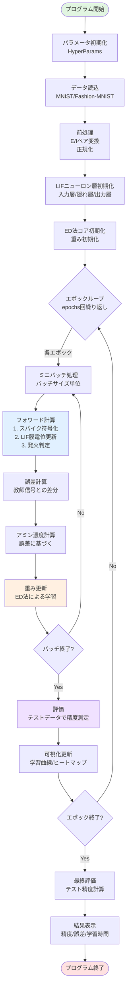
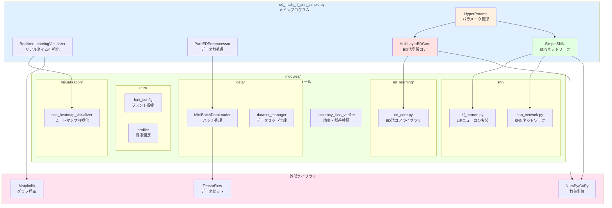

# ED法 SNN Simple版 - 学習・理解用実装

[**日本語**](README.md) | [English](README_EN.md)

`ed_multi_lif_snn_simple.py`は、ED法（Error-Diffusion法）とスパイキングニューラルネットワーク（SNN）の**学習・理解に特化した教育用実装**です。

## 🎯 Simple版の目的

- **📚 アルゴリズム理解**: ED法とSNNの実装方法を学習
- **🔧 コード理解**: シンプルで理解しやすい実装構造
- **⚡ 基本機能**: 必要最小限の機能で動作原理を把握
- **📖 教育特化**: 詳細なコメントと説明付き

## 🌟 Simple版の特徴

### ✅ 教育用に最適化された設計

- **シンプルな構造**: 複雑な機能を排除し、核心部分に集中
- **豊富なコメント**: 各処理の意味と役割を詳細に説明
- **理解しやすいパラメータ**: デフォルト値で安定動作
- **基本機能重視**: ED法とSNNの基本原理の実装に特化

### 🧠 実装されている核心機能

1. **ED法学習アルゴリズム**
   - アミン拡散による重み更新
   - 生物学的妥当性を保持した学習
   - 誤差逆伝播を使わない局所学習

2. **完全LIFニューロン実装**
   - 入力層・隠れ層・出力層すべてがLIFニューロン
   - ポアソン符号化によるスパイク生成
   - 生物学的に妥当なスパイク動作

3. **E/Iペア構造**
   - 興奮性(E)・抑制性(I)ニューロンペア
   - Dale's Principle（デールの原理）準拠
   - 生物学的妥当性の保証

## 🚀 基本的な使い方

### 必要環境

```bash
pip install numpy tensorflow matplotlib tqdm
```

### 基本実行

```bash
# MNISTデータセットで基本学習
python src/ja/ed_multi_lif_snn_simple.py --mnist --train 1000 --test 100 --epochs 10

# Fashion-MNISTデータセットで学習
python src/ja/ed_multi_lif_snn_simple.py --fashion --train 1000 --test 100 --epochs 10
```

### 可視化付き実行

```bash
# リアルタイム学習進捗表示
python src/ja/ed_multi_lif_snn_simple.py --mnist --train 1000 --test 100 --epochs 10 --viz

# ヒートマップ表示付き
python src/ja/ed_multi_lif_snn_simple.py --mnist --train 1000 --test 100 --epochs 10 --viz --heatmap
```

## 📊 主要なコマンドライン引数

### データセット選択
- `--mnist`: MNISTデータセット使用（デフォルト）
- `--fashion`: Fashion-MNISTデータセット使用

### 学習設定
- `--train N`: 訓練サンプル数（デフォルト: 512）
- `--test N`: テストサンプル数（デフォルト: 512）
- `--epochs N`: エポック数（デフォルト: 10）
- `--hidden N`: 隠れ層ニューロン数（デフォルト: 128）
- `--batch N`: ミニバッチサイズ（デフォルト: 128）

### ED法パラメータ
- `--lr FLOAT`: 学習率（デフォルト: 0.1）
- `--ami FLOAT`: アミン濃度（デフォルト: 0.25）
- `--dif FLOAT`: 拡散係数（デフォルト: 0.5）

### 可視化
- `--viz`: リアルタイム学習進捗表示
- `--heatmap`: スパイク活動ヒートマップ表示
- `--verbose`: 詳細ログ表示

## 📐 システム構成図

### 1. ハイレベルフローチャート（全体の動作フロー）



### 2. システム全体構成図（ブロックダイアグラム）



### 3. ED学習ループ詳細フロー（ブレークダウン版）

```mermaid
flowchart TD
    Start([エポック開始]) --> ShuffleData[データシャッフル<br/>ランダム順序生成]
    
    ShuffleData --> GetBatch[ミニバッチ取得<br/>batch_size個のサンプル]
    
    GetBatch --> SpikeEncode[スパイク符号化<br/>ポアソン符号化]
    
    subgraph Forward["フォワード計算"]
        SpikeEncode --> InputLIF[入力層LIF処理<br/>スパイク→膜電位]
        InputLIF --> InputFire[入力層発火判定<br/>閾値超過チェック]
        InputFire --> HiddenCalc[隠れ層計算<br/>重み付き和]
        HiddenCalc --> HiddenLIF[隠れ層LIF処理<br/>膜電位更新]
        HiddenLIF --> HiddenFire[隠れ層発火判定]
        HiddenFire --> OutputCalc[出力層計算<br/>各クラスの活性]
        OutputCalc --> OutputLIF[出力層LIF処理]
        OutputLIF --> OutputFire[出力層発火判定<br/>予測結果]
    end
    
    OutputFire --> CompareTeacher[教師信号との比較<br/>正解ラベルとの差分]
    
    subgraph Learning["ED法学習"]
        CompareTeacher --> CalcOutputError[出力誤差計算<br/>teacher - output]
        CalcOutputError --> OutputAmine[出力層アミン濃度<br/>誤差に基づく計算]
        OutputAmine --> DiffuseAmine[アミン拡散<br/>隠れ層へ伝播]
        DiffuseAmine --> HiddenAmine[隠れ層アミン濃度<br/>拡散率 × 出力誤差]
        HiddenAmine --> UpdateOutputW[出力層重み更新<br/>Δw = α × amine × input × error]
        UpdateOutputW --> UpdateHiddenW[隠れ層重み更新<br/>同様のED法則]
        UpdateHiddenW --> ApplyDale[Dale's Principle適用<br/>E: w≥0, I: w≤0]
    end
    
    ApplyDale --> UpdateStats[統計更新<br/>精度・誤差記録]
    
    UpdateStats --> CheckBatch{全バッチ<br/>処理完了?}
    CheckBatch -->|No| GetBatch
    CheckBatch -->|Yes| TestEval[テスト評価<br/>検証データで精度計算]
    
    TestEval --> UpdateViz[可視化更新<br/>グラフ・ヒートマップ]
    UpdateViz --> End([エポック終了])
    
    style Forward fill:#e1f0ff
    style Learning fill:#fff0e1
    style Start fill:#e1f5e1
    style End fill:#ffe1e1
    style SpikeEncode fill:#f0e1ff
    style ApplyDale fill:#ffe1f0
```



## 🔬 Simple版で学習できる内容

### 1. ED法の基本原理
```python
# アミン濃度による重み更新（実際のコードから抜粋）
def update_weights_ed_method(self, layer_idx, amine_concentration, input_activity, output_error):
    """ED法による重み更新 - 生物学的妥当性保持"""
    # アミン濃度 × 入力活性 × 出力誤差
    delta_w = self.learning_rate * amine_concentration * input_activity * output_error
    return delta_w
```

### 2. LIFニューロンの動作
```python
# LIFニューロンの膜電位計算
def update_membrane_potential(self, v_current, i_syn, dt):
    """LIFニューロンの膜電位更新"""
    dv_dt = (self.v_rest - v_current + i_syn) / self.tau_m
    v_new = v_current + dv_dt * dt
    return v_new
```

### 3. スパイク符号化
```python
# ポアソン符号化によるスパイク生成
def poisson_encoding(self, input_data, max_rate, sim_time, dt):
    """ポアソン過程によるスパイク符号化"""
    spike_rates = input_data * max_rate
    spike_trains = self.generate_poisson_spikes(spike_rates, sim_time, dt)
    return spike_trains
```

## 📈 期待される学習成果

### パフォーマンス目標
- **MNIST**: 約75-85%の正答率
- **Fashion-MNIST**: 約70-80%の正答率
- **学習時間**: 10エポックで数分程度

### 学習効果
- ED法の動作原理の理解
- SNNとLIFニューロンの基本概念の習得
- 生物学的妥当性を持つ学習アルゴリズムの体験
- Python実装における数値計算の基礎

## 🔄 通常版との違い

| 項目 | Simple版 | 通常版（ed_multi_lif_snn.py） |
|------|----------|------------------------------|
| **目的** | 学習・理解用 | 実験・研究用 |
| **機能** | 基本機能のみ | 全機能搭載 |
| **複雑さ** | シンプル | 高機能・高性能 |
| **パラメータ** | 固定・最適化済み | 細かい調整可能 |
| **多層対応** | 単層のみ | 任意の多層構造 |
| **GPU対応** | 基本対応 | 完全最適化 |
| **可視化** | 基本表示 | 高度な可視化 |

## 📚 関連ドキュメント

- 📖 [メインREADME](README.md) - プロジェクト全体の概要
- 🔬 [ED法解説](docs/ja/ED法_解説資料.md) - ED法の理論詳細
- 🧠 [技術詳細](TECHNICAL_DOCS.md) - 実装の技術解説

## 🎓 学習の進め方

### Step 1: 基本実行
```bash
python src/ja/ed_multi_lif_snn_simple.py --mnist --train 500 --test 100 --epochs 5
```

### Step 2: パラメータ理解
```bash
python src/ja/ed_multi_lif_snn_simple.py --mnist --lr 0.05 --ami 0.3 --epochs 10
```

### Step 3: 可視化確認
```bash
python src/ja/ed_multi_lif_snn_simple.py --mnist --viz --heatmap --epochs 10
```

### Step 4: コード読解
- `HyperParams`クラス: パラメータ管理
- `LIFNeuron`クラス: ニューロン実装
- `EDMultiLIFSNN`クラス: ネットワーク本体

## 💡 学習のポイント

1. **ED法の特徴**: 誤差逆伝播を使わない生物学的学習
2. **アミン拡散**: 層間での誤差信号伝達メカニズム
3. **LIFニューロン**: 生物学的に妥当なニューロンモデル
4. **スパイク符号化**: アナログ→スパイク変換の理解
5. **E/Iペア**: 興奮・抑制ニューロンの協調動作

---

**🎯 Simple版で基礎を学び、通常版で本格的な実験を！**

Simple版でED法とSNNの基本を理解した後は、`ed_multi_lif_snn.py`で本格的な研究・実験に取り組んでください。