# ED-Method SNN Simple Version - Educational Implementation

[日本語](README_simple.md) | [**English**](README_simple_EN.md)

`ed_multi_lif_snn_simple.py` is an **educational implementation specialized for learning and understanding** the ED (Error-Diffusion) method and Spiking Neural Networks (SNN).

## 🎯 Purpose of Simple Version

- **📚 Algorithm Understanding**: Learn implementation methods of ED method and SNN
- **🔧 Code Comprehension**: Simple and easy-to-understand implementation structure
- **⚡ Basic Features**: Grasp operating principles with minimum necessary functions
- **📖 Education-Focused**: Detailed comments and explanations included

## 🌟 Features of Simple Version

### ✅ Design Optimized for Education

- **Simple Structure**: Eliminate complex features and focus on core parts
- **Rich Comments**: Detailed explanations of the meaning and role of each process
- **Easy-to-Understand Parameters**: Stable operation with default values
- **Basic Function Focus**: Specialized in implementing basic principles of ED method and SNN

### 🧠 Core Features Implemented

1. **ED-Method Learning Algorithm**
   - Weight update by amine diffusion
   - Learning that maintains biological plausibility
   - Local learning without backpropagation

2. **Complete LIF Neuron Implementation**
   - All layers (input, hidden, output) use LIF neurons
   - Spike generation by Poisson encoding
   - Biologically plausible spike behavior

3. **E/I Pair Structure**
   - Excitatory (E) and Inhibitory (I) neuron pairs
   - Compliant with Dale's Principle
   - Guarantee of biological plausibility

## 🚀 Basic Usage

### Required Environment

```bash
pip install numpy tensorflow matplotlib tqdm
```

### Basic Execution

```bash
# Basic learning with MNIST dataset
python src/ja/ed_multi_lif_snn_simple.py --mnist --train 1000 --test 100 --epochs 10

# Learning with Fashion-MNIST dataset
python src/ja/ed_multi_lif_snn_simple.py --fashion --train 1000 --test 100 --epochs 10
```

### Execution with Visualization

```bash
# Real-time learning progress display
python src/ja/ed_multi_lif_snn_simple.py --mnist --train 1000 --test 100 --epochs 10 --viz

# With heatmap display
python src/ja/ed_multi_lif_snn_simple.py --mnist --train 1000 --test 100 --epochs 10 --viz --heatmap
```

## 📊 Main Command-Line Arguments

### Dataset Selection
- `--mnist`: Use MNIST dataset (default)
- `--fashion`: Use Fashion-MNIST dataset

### Training Settings
- `--train N`: Number of training samples (default: 512)
- `--test N`: Number of test samples (default: 512)
- `--epochs N`: Number of epochs (default: 10)
- `--hidden N`: Number of hidden layer neurons (default: 128)
- `--batch N`: Mini-batch size (default: 128)

### ED-Method Parameters
- `--lr FLOAT`: Learning rate (default: 0.1)
- `--ami FLOAT`: Amine concentration (default: 0.25)
- `--dif FLOAT`: Diffusion coefficient (default: 0.5)

### Visualization
- `--viz`: Real-time learning progress display
- `--heatmap`: Spike activity heatmap display
- `--verbose`: Detailed log display

## 📐 System Architecture Diagrams

### 1. High-Level Flowchart (Overall Operation Flow)


### 2. Overall System Architecture (Block Diagram)

#### 2-1. Main Program Structure


#### 2-2. Module Dependencies

**Block ①: Data Processing System**

```mermaid
flowchart LR
    Prep["PureEDPreprocessor<br/><br/>Data Preprocessing<br/>・E/I pair conversion<br/>・Normalization<br/>・Batch generation"]
    
    Prep --> DataLoader["📦 MiniBatchDataLoader<br/><br/>Mini-batch Processing<br/>・Batch generation<br/>・Shuffling<br/>・Sampling"]
    
    DataLoader --> DataMgr["dataset_manager<br/><br/>Dataset Management<br/>・MNIST loading<br/>・Fashion-MNIST loading<br/>・Class label management"]
    
    DataLoader --> TF["🔧 TensorFlow<br/><br/>Dataset<br/>Library<br/>・tfds.load()"]
    
    style Prep fill:#e1f5e1,stroke:#333,stroke-width:3px,color:#000
    style DataLoader fill:#fff0e1,stroke:#333,stroke-width:3px,color:#000
    style DataMgr fill:#e1f5f0,stroke:#333,stroke-width:2px,color:#000
    style TF fill:#ffe1f0,stroke:#333,stroke-width:2px,color:#000
```


**Block ②: Learning & Neuron Processing System**

```mermaid
flowchart LR
    EDCore["MultiLayerEDCore<br/><br/>ED-Method Learning Core<br/>・Weight update<br/>・Amine diffusion<br/>・Error calculation"]
    
    SNN["SimpleSNN<br/><br/>SNN Network<br/>・LIF layer management<br/>・Spike processing<br/>・Firing decision"]
    
    Viz["RealtimeLearningVisualizer<br/><br/>Real-time Visualization<br/>・Learning curve display<br/>・Confusion matrix<br/>・Accuracy graphs"]
    
    EDCore --> EDLib["📦 ed_core.py<br/><br/>ED-Method Core Library<br/>・Weight initialization<br/>・Forward calculation<br/>・Amine concentration calculation<br/>・Gradient calculation"]
    
    SNN --> LIF["📦 lif_neuron.py<br/><br/>LIF Neuron Implementation<br/>・Membrane potential update formula<br/>・Firing decision<br/>・Refractory period management<br/>・Poisson encoding"]
    
    SNN --> SNNNet["snn_network.py<br/><br/>SNN Network<br/>・Multi-layer structure management<br/>・Inter-layer connection<br/>・Spike propagation"]
    
    Viz --> Heatmap["snn_heatmap_visualizer<br/><br/>Heatmap Visualization<br/>・Firing pattern display<br/>・Layer-wise activity<br/>・Time series analysis"]
    
    EDCore --> NP1["🔧 NumPy/CuPy<br/><br/>Numerical Computation<br/>Library<br/>・Matrix operations"]
    
    SNN --> NP2["🔧 NumPy/CuPy<br/><br/>Numerical Computation<br/>Library<br/>・Matrix operations"]
    
    Viz --> MPL["🔧 Matplotlib<br/><br/>Graph Drawing<br/>Library<br/>・plot/imshow"]
    
    style EDCore fill:#ffe1e1,stroke:#333,stroke-width:3px,color:#000
    style SNN fill:#e1ffe1,stroke:#333,stroke-width:3px,color:#000
    style Viz fill:#f0e1ff,stroke:#333,stroke-width:3px,color:#000
    style EDLib fill:#ffe1e1,stroke:#333,stroke-width:2px,color:#000
    style LIF fill:#e1ffe1,stroke:#333,stroke-width:2px,color:#000
    style SNNNet fill:#e1ffe1,stroke:#333,stroke-width:2px,color:#000
    style Heatmap fill:#f0e1ff,stroke:#333,stroke-width:2px,color:#000
    style NP1 fill:#ffe1f0,stroke:#333,stroke-width:2px,color:#000
    style NP2 fill:#ffe1f0,stroke:#333,stroke-width:2px,color:#000
    style MPL fill:#ffe1f0,stroke:#333,stroke-width:2px,color:#000
```


**Block ③: Utility System**

```mermaid
flowchart LR
    Main["Main Program<br/><br/>Overall Control<br/>・Initialization<br/>・Learning loop<br/>・Evaluation execution"]
    
    Main --> Verifier["accuracy_loss_verifier<br/><br/>Accuracy & Loss Verification<br/>・Calculation accuracy check<br/>・Error validity confirmation<br/>・Debug support"]
    
    Main --> Font["font_config<br/><br/>Font Settings<br/>・Japanese fonts<br/>・For graph display<br/>・OS-specific support"]
    
    Main --> Profiler["profiler<br/><br/>Performance Measurement<br/>・Processing time measurement<br/>・Bottleneck identification<br/>・Optimization support"]
    
    style Main fill:#e1f0ff,stroke:#333,stroke-width:3px,color:#000
    style Verifier fill:#fff0e1,stroke:#333,stroke-width:2px,color:#000
    style Font fill:#e1f5f0,stroke:#333,stroke-width:2px,color:#000
    style Profiler fill:#ffe1e1,stroke:#333,stroke-width:2px,color:#000
```


### 3. ED Learning Loop Detailed Flow (Breakdown Version)

```mermaid
flowchart TD
    Start([Epoch Start]) --> ShuffleData[Data Shuffling<br/>Random order generation]
    
    ShuffleData --> GetBatch[Get Mini-Batch<br/>batch_size samples]
    
    GetBatch --> SpikeEncode[Spike Encoding<br/>Poisson encoding]
    
    subgraph Forward["Forward Calculation"]
        SpikeEncode --> InputLIF[Input Layer LIF Processing<br/>Spike → Membrane Potential]
        InputLIF --> InputFire[Input Layer Firing Decision<br/>Threshold crossing check]
        InputFire --> HiddenCalc[Hidden Layer Calculation<br/>Weighted sum]
        HiddenCalc --> HiddenLIF[Hidden Layer LIF Processing<br/>Membrane potential update]
        HiddenLIF --> HiddenFire[Hidden Layer Firing Decision]
        HiddenFire --> OutputCalc[Output Layer Calculation<br/>Activity for each class]
        OutputCalc --> OutputLIF[Output Layer LIF Processing]
        OutputLIF --> OutputFire[Output Layer Firing Decision<br/>Prediction result]
    end
    
    OutputFire --> CompareTeacher[Compare with Teacher Signal<br/>Difference from correct label]
    
    subgraph Learning["ED-Method Learning"]
        CompareTeacher --> CalcOutputError[Output Error Calculation<br/>teacher - output]
        CalcOutputError --> OutputAmine[Output Layer Amine Concentration<br/>Calculation based on error]
        OutputAmine --> DiffuseAmine[Amine Diffusion<br/>Propagation to hidden layer]
        DiffuseAmine --> HiddenAmine[Hidden Layer Amine Concentration<br/>Diffusion rate × Output error]
        HiddenAmine --> UpdateOutputW[Output Layer Weight Update<br/>Δw = α × amine × input × error]
        UpdateOutputW --> UpdateHiddenW[Hidden Layer Weight Update<br/>Same ED principle]
        UpdateHiddenW --> ApplyDale[Apply Dale's Principle<br/>E: w≥0, I: w≤0]
    end
    
    ApplyDale --> UpdateStats[Update Statistics<br/>Record accuracy & error]
    
    UpdateStats --> CheckBatch{All Batches<br/>Processed?}
    CheckBatch -->|No| GetBatch
    CheckBatch -->|Yes| TestEval[Test Evaluation<br/>Accuracy calculation on validation data]
    
    TestEval --> UpdateViz[Visualization Update<br/>Graphs & Heatmaps]
    UpdateViz --> End([Epoch End])
    
    style Forward fill:#e1f0ff,stroke:#333,stroke-width:2px,color:#000
    style Learning fill:#fff0e1,stroke:#333,stroke-width:2px,color:#000
    style Start fill:#e1f5e1,stroke:#333,stroke-width:2px,color:#000
    style End fill:#ffe1e1,stroke:#333,stroke-width:2px,color:#000
    style SpikeEncode fill:#f0e1ff,stroke:#333,stroke-width:2px,color:#000
    style ApplyDale fill:#ffe1f0,stroke:#333,stroke-width:2px,color:#000
```



## 🔬 What You Can Learn with Simple Version

### 1. Basic Principles of ED Method
```python
# Weight update by amine concentration (excerpt from actual code)
def update_weights_ed_method(self, layer_idx, amine_concentration, input_activity, output_error):
    """Weight update by ED method - Maintains biological plausibility"""
    # Amine concentration × Input activity × Output error
    delta_w = self.learning_rate * amine_concentration * input_activity * output_error
    return delta_w
```

### 2. LIF Neuron Operation
```python
# LIF neuron membrane potential calculation
def update_membrane_potential(self, v_current, i_syn, dt):
    """LIF neuron membrane potential update"""
    dv_dt = (self.v_rest - v_current + i_syn) / self.tau_m
    v_new = v_current + dv_dt * dt
    return v_new
```

### 3. Spike Encoding
```python
# Spike generation by Poisson encoding
def poisson_encoding(self, input_data, max_rate, sim_time, dt):
    """Spike encoding by Poisson process"""
    spike_rates = input_data * max_rate
    spike_trains = self.generate_poisson_spikes(spike_rates, sim_time, dt)
    return spike_trains
```

## 📈 Expected Learning Outcomes

### Performance Goals
- **MNIST**: Approximately 75-85% accuracy
- **Fashion-MNIST**: Approximately 70-80% accuracy
- **Training Time**: About several minutes for 10 epochs

### Learning Effects
- Understanding of ED method operating principles
- Acquisition of basic concepts of SNN and LIF neurons
- Experience with biologically plausible learning algorithms
- Fundamentals of numerical computation in Python implementation

## 🔄 Differences from Standard Version

| Item | Simple Version | Standard Version (ed_multi_lif_snn.py) |
|------|----------------|----------------------------------------|
| **Purpose** | Learning & Understanding | Experimentation & Research |
| **Features** | Basic features only | All features included |
| **Complexity** | Simple | High-function & High-performance |
| **Parameters** | Fixed & Optimized | Fine-tunable |
| **Multi-layer Support** | Single layer only | Arbitrary multi-layer structure |
| **GPU Support** | Basic support | Fully optimized |
| **Visualization** | Basic display | Advanced visualization |

## 📚 Related Documents

- 📖 [Main README](README.md) - Project overview
- 🔬 [ED Method Explanation](docs/ja/ED法_解説資料.md) - Theoretical details of ED method (Japanese)
- 🧠 [Technical Details](TECHNICAL_DOCS.md) - Technical explanation of implementation

## 🎓 Learning Path

### Step 1: Basic Execution
```bash
python src/ja/ed_multi_lif_snn_simple.py --mnist --train 500 --test 100 --epochs 5
```

### Step 2: Parameter Understanding
```bash
python src/ja/ed_multi_lif_snn_simple.py --mnist --lr 0.05 --ami 0.3 --epochs 10
```

### Step 3: Visualization Verification
```bash
python src/ja/ed_multi_lif_snn_simple.py --mnist --viz --heatmap --epochs 10
```

### Step 4: Code Reading
- `HyperParams` class: Parameter management
- `LIFNeuron` class: Neuron implementation
- `EDMultiLIFSNN` class: Network main body

## 💡 Learning Points

1. **ED Method Characteristics**: Biologically plausible learning without backpropagation
2. **Amine Diffusion**: Error signal transmission mechanism between layers
3. **LIF Neuron**: Biologically plausible neuron model
4. **Spike Encoding**: Understanding analog → spike conversion
5. **E/I Pair**: Cooperative operation of excitatory and inhibitory neurons

---

**🎯 Learn the basics with Simple version, then conduct full-scale experiments with Standard version!**

After understanding the basics of ED method and SNN with the Simple version, proceed to full-scale research and experimentation with `ed_multi_lif_snn.py`.
