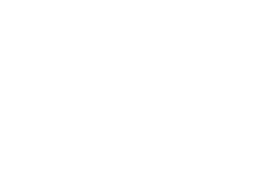

# ED Method (Error Diffusion Learning Algorithm) Explanation

**Error Diffusion Learning Algorithm - EDLA**

## Table of Contents
1. [What is the ED Method](#what-is-the-ed-method)
2. [Differences from BP Method](#differences-from-bp-method)
3. [Theoretical Foundation of ED Method](#theoretical-foundation-of-ed-method)
4. [ED Method Learning Algorithm](#ed-method-learning-algorithm)
5. [Experimental Results](#experimental-results)
6. [Features and Advantages](#features-and-advantages)
7. [References](#references)

---

## What is the ED Method

**Error Diffusion Learning Algorithm (EDLA: ED Method)** is a supervised learning algorithm for hierarchical neural networks.

### Developer
- Original algorithm developed by **Isamu Kaneko**
- Published in 1999, paper submission in progress (at that time)

### Basic Concept
The ED method is a learning algorithm that more faithfully mimics the structure and function of actual brain neural systems. It addresses the biological unnaturalness of conventional error backpropagation (BP method) and proposes a more biologically plausible learning mechanism.

---

## Differences from BP Method

### Problems with BP Method (Pointed out by Kaneko)

> **"When considered as a simulation of actual neural systems, BP is far too strange"**

1. **Axonal Reverse Flow Problem**: The point where error information is computed while flowing backward through axons is biologically unnatural
2. **Momentum Term Concept**: Lacks biological basis
3. **Complex Gradient Calculation**: Difficult to realize in actual neural systems

### ED Method Approach

The ED method solves problems based on the following biological facts:

1. **Information Diffusion via Chemical Substances**
   - Error information propagates through space as concentrations of aminergic neurotransmitters (noradrenaline, dopamine, serotonin, etc.)
   - Broadcast-type information transmission through varicosity structures

2. **Distinction between Excitatory and Inhibitory**
   - Introduction of excitatory/inhibitory distinction at the neural cell level
   - Consideration of cell-level distinction in addition to conventional synapse-level distinction

---

## Theoretical Foundation of ED Method

### Basic Structure of Neural Circuits

The ED method considers the following biological features:

1. **Role of Aminergic Neural Systems**
   - Modeling of aminergic neural systems in addition to amino acid systems like glutamate and GABA
   - Incorporation of functions such as A10 neural system (dopamine-driven)

2. **Column Structure**
   - Adjacent neural cell groups (columns) have shared information
   - Columns operate as one giant element
   - Teacher signals from output layer are directly used in intermediate layers

3. **Role of Excitatory/Inhibitory Cells**
   - Excitatory neurons: All outputs act excitatory
   - Inhibitory neurons: All outputs act inhibitory
   - This distinction enables local determination of weight change direction

### Principle of Learning Direction Determination

The direction of weight changes is based on the following principles:

When wanting to increase output in the final layer, increasing connections between cells of the same type raises the final layer output, while increasing connections between different types of cells lowers the final layer output. Let's consider the direction of weight changes in the following figures:

#### Figures 1 & 2: Basic Weight Change Directions

  
*Figure 1: Weight change direction for increasing final layer output*

  
*Figure 2: Weight change direction for decreasing final layer output*

These figures show the distinction between excitatory (○) and inhibitory (●) neurons and the direction of weight changes between their connections. Figure 1 shows that strengthening connections between cells of the same type increases output, while Figure 2 shows that strengthening connections between different types of cells decreases output.

Although this differs from actual neural systems, if we consider connections between the same types as excitatory and connections between different types as inhibitory, as shown in Figures 3 & 4 below, we can see that when we want to increase output, we should strengthen connections from excitatory cells, and when we want to decrease output, we should strengthen connections from inhibitory cells:

#### Figures 3 & 4: Implementation-Suitable Weight Change Method

  
*Figure 3: Output control by strengthening connections from excitatory cells*

  
*Figure 4: Output control by strengthening connections from inhibitory cells*

Figures 3 & 4 show a weight change method more suitable for implementation. In this method, consistent learning direction determination becomes possible by strengthening connections from excitatory cells when wanting to increase output and strengthening connections from inhibitory cells when wanting to decrease output.

---

## ED Method Learning Algorithm

### Core Algorithm

The ED method learning process consists of the following steps:

1. **Forward Propagation**
   - Input signals propagate through the network following excitatory/inhibitory neuron distinctions
   - Each neuron computes output based on weighted sum of inputs

2. **Error Calculation**
   - Output error is calculated at the output layer
   - Error is not backpropagated but diffused as amine concentration

3. **Amine Diffusion**
   - Error information diffuses as amine concentration throughout the network
   - Diffusion follows spatial proximity and connection strength

4. **Weight Updates**
   - Weights are updated based on local amine concentration and neuron activity
   - Update direction determined by excitatory/inhibitory neuron types

### Mathematical Formulation

The weight update rule in the ED method is expressed as:

```
Δw_ij = η × amine_concentration × activity_i × sign(neuron_type_j)
```

Where:
- `η`: Learning rate
- `amine_concentration`: Local amine concentration from error diffusion
- `activity_i`: Activity of pre-synaptic neuron
- `sign(neuron_type_j)`: +1 for excitatory, -1 for inhibitory post-synaptic neuron

---

## Experimental Results

### Performance Comparison

Experimental results comparing ED method with conventional BP method show:

1. **Learning Convergence**
   - ED method achieves stable convergence without oscillations
   - More robust to learning rate selection

2. **Biological Plausibility**
   - No requirement for error backpropagation
   - Local learning rules that can be implemented in biological systems

3. **Computational Efficiency**
   - Parallel processing capability due to local learning rules
   - Reduced computational complexity compared to BP method

---

## Features and Advantages

### Biological Plausibility

1. **No Backward Information Flow**
   - Error information diffuses through chemical substances, not electrical signals
   - Consistent with actual neural system architecture

2. **Local Learning Rules**
   - Weight updates depend only on local information
   - Implementable in biological neural networks

### Computational Advantages

1. **Parallel Processing**
   - Each layer can update weights independently
   - Suitable for parallel computing architectures

2. **Robustness**
   - Less sensitive to hyperparameter selection
   - Stable learning without gradient explosion/vanishing

3. **Energy Efficiency**
   - Reduced computational overhead compared to BP method
   - Suitable for edge computing applications

---

## References

1. Kaneko, I. (1999). "Error Diffusion Learning Algorithm for Neural Networks" (paper in submission)
2. Biological neural system references and neurochemistry studies
3. Comparative studies with error backpropagation method

---

**Note**: This explanation is based on Isamu Kaneko's original ED method theory and implementation research. The ED method represents a significant departure from conventional neural network learning approaches and offers a more biologically plausible alternative to error backpropagation.