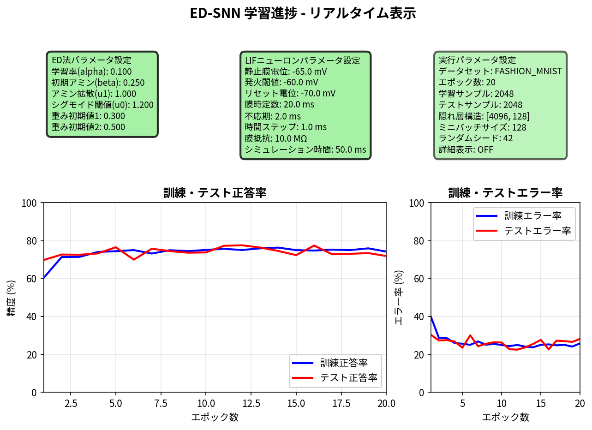
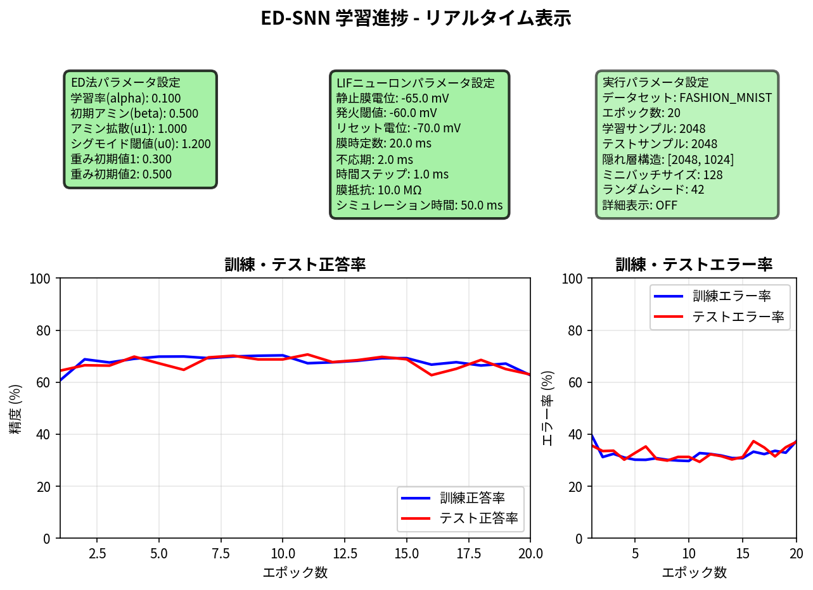
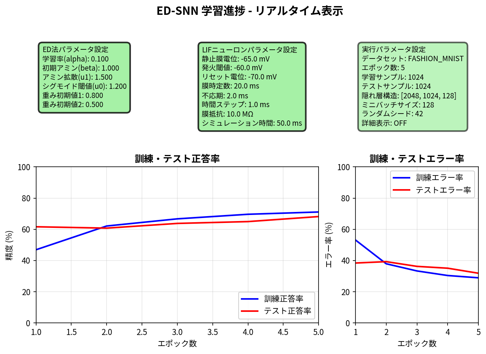
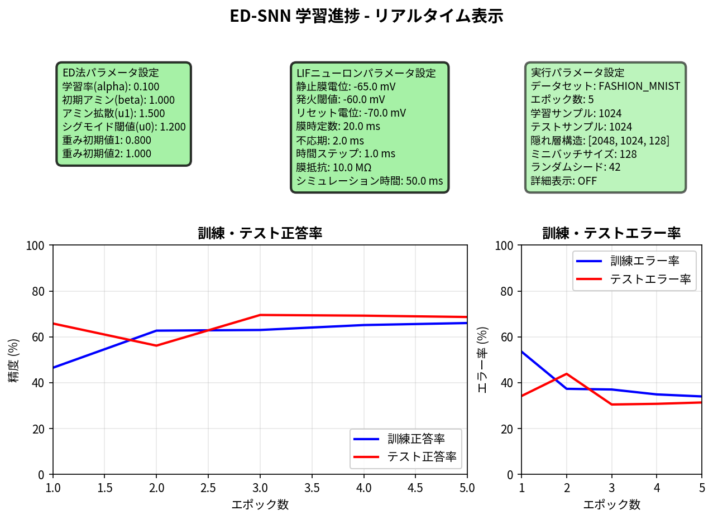

## 1.python ed_multi_frelu_snn.py --viz --heatmap --fashion --seed 42 --train 2048 --test 2048 --batch 128 --save_fig viz_results_for_public/frelu_snn_fashion_hid4096_128_epo20 --hidden 4096,128 --epochs 20 --dif 1.0

【ED法アルゴリズムパラメータ】 
  学習率 (alpha):         0.100 
  初期アミン濃度 (beta):  0.250 
  アミン拡散係数 (u1):    1.000 
  シグモイド閾値 (u0):    1.200 
  重み初期値1:            0.300 
  重み初期値2:            0.500 
 
【LIFニューロンパラメータ】 
  静止膜電位 (v_rest):    -65.0 mV 
  発火閾値 (v_threshold): -60.0 mV 
  リセット電位 (v_reset): -70.0 mV 
  膜時定数 (tau_m):       20.0 ms 
  不応期 (tau_ref):       2.0 ms 
  時間ステップ (dt):      1.0 ms 
  膜抵抗 (R_m):           10.0 MΩ 
  シミュレーション時間:   50.0 ms 
  LIF層使用:              入力層のみ (SNN) 
    - 入力層:             LIF + スパイク符号化 
    - 隠れ層・出力層:     FReLU活性化関数 (論文準拠) 
  FReLU仕様:              Funnel Activation (最適化版) 
    - 閾値パラメータ:     α=0.15 (69.6%実績ベース) 
    - Dale's Principle:   興奮性/抑制性ニューロン対応 
    - 数値安定性:         シグモイドスムージング適用 
    - 非線形関数:         max(x, αx) / min(x, -α|x|) 
  計算効率:               LIF比約10-50倍高速化 
  スパイク符号化方式:     poisson 
  スパイク最大発火率:     100.0 Hz 
  スパイクシミュレーション時間: 50.0 ms 
  スパイク時間ステップ:   1.0 ms 
 
【実行時設定パラメータ】 
  データセット:           Fashion-MNIST 
  訓練データ数:           2048 
  テストデータ数:         2048 
  エポック数:             20 
  隠れ層構造:             4096,128 (多層) 
  ミニバッチサイズ:       128 (ミニバッチ) 
  ランダムシード:         42 
  データシャッフル:       ON 
  リアルタイム可視化:     ON 
  詳細表示:               OFF 

100%|█████████████| 20/20 [10:51:02<00:00, 1953.13s/epoch, 訓精=74.2%, テ精=71.9%, 訓エ=25.8%, テエ=28.1%]
 
✅ 最終結果: 
   学習精度: 74.22% 
   テスト正答率: 73.19% 

## 2.python3 ed_multi_frelu_snn_backup.py --fashion --train 2048 --test 2048 --epochs 10 --hidden 512,128 --batch 128 --lr 0.2 --ami 0.35 --dif 0.6 --viz --heatmap

【ED法アルゴリズムパラメータ】 
  学習率 (alpha):         0.200 
  初期アミン濃度 (beta):  0.350 
  アミン拡散係数 (u1):    0.600 
  シグモイド閾値 (u0):    1.200 
  重み初期値1:            0.300 
  重み初期値2:            0.500 
 
【LIFニューロンパラメータ】 
  静止膜電位 (v_rest):    -65.0 mV 
  発火閾値 (v_threshold): -60.0 mV 
  リセット電位 (v_reset): -70.0 mV 
  膜時定数 (tau_m):       20.0 ms 
  不応期 (tau_ref):       2.0 ms 
  時間ステップ (dt):      1.0 ms 
  膜抵抗 (R_m):           10.0 MΩ 
  シミュレーション時間:   50.0 ms 
  LIF層使用:              入力層のみ (SNN) 
    - 入力層:             LIF + スパイク符号化 
    - 隠れ層・出力層:     FReLU活性化関数 (論文準拠) 
  FReLU仕様:              Funnel Activation (最適化版) 
    - 閾値パラメータ:     α=0.15 (69.6%実績ベース) 
    - Dale's Principle:   興奮性/抑制性ニューロン対応 
    - 数値安定性:         シグモイドスムージング適用 
    - 非線形関数:         max(x, αx) / min(x, -α|x|) 
  計算効率:               LIF比約10-50倍高速化 
  スパイク符号化方式:     poisson 
  スパイク最大発火率:     100.0 Hz 
  スパイクシミュレーション時間: 50.0 ms 
  スパイク時間ステップ:   1.0 ms 
 
【実行時設定パラメータ】 
  データセット:           Fashion-MNIST 
  訓練データ数:           2048 
  テストデータ数:         2048 
  エポック数:             10 
  隠れ層構造:             512,128 (多層) 
  ミニバッチサイズ:       128 (ミニバッチ) 
  ランダムシード:         ランダム 
  データシャッフル:       ON 
  リアルタイム可視化:     ON 
  詳細表示:               OFF 
  図表保存:               OFF 

100%|█████████████| 10/10 [2:00:23<00:00, 722.37s/epoch, 訓精=62.7%, テ精=62.9%, 訓エ=37.3%, テエ=37.1%]
 
✅ 最終結果: 
   学習精度: 62.74% 
   テスト正答率: 62.65% 

## 3.python ed_multi_frelu_snn.py --viz --heatmap --fashion --seed 42 --train 2048 --test 2048 --batch 128 --save_fig viz_results_for_public/frelu_snn_fashion_hid2048_1024_epo20_ami0.5_dif1.0 --hidden 2048,1024 --epochs 20 --ami 0.5 --dif 1.0

【ED法アルゴリズムパラメータ】 
  学習率 (alpha):         0.100 
  初期アミン濃度 (beta):  0.500 
  アミン拡散係数 (u1):    1.000 
  シグモイド閾値 (u0):    1.200 
  重み初期値1:            0.300 
  重み初期値2:            0.500 
 
【LIFニューロンパラメータ】 
  静止膜電位 (v_rest):    -65.0 mV 
  発火閾値 (v_threshold): -60.0 mV 
  リセット電位 (v_reset): -70.0 mV 
  膜時定数 (tau_m):       20.0 ms 
  不応期 (tau_ref):       2.0 ms 
  時間ステップ (dt):      1.0 ms 
  膜抵抗 (R_m):           10.0 MΩ 
  シミュレーション時間:   50.0 ms 
  LIF層使用:              入力層のみ (SNN) 
    - 入力層:             LIF + スパイク符号化 
    - 隠れ層・出力層:     FReLU活性化関数 (論文準拠) 
  FReLU仕様:              Funnel Activation (最適化版) 
    - 閾値パラメータ:     α=0.15 (69.6%実績ベース) 
    - Dale's Principle:   興奮性/抑制性ニューロン対応 
    - 数値安定性:         シグモイドスムージング適用 
    - 非線形関数:         max(x, αx) / min(x, -α|x|) 
  計算効率:               LIF比約10-50倍高速化 
  スパイク符号化方式:     poisson 
  スパイク最大発火率:     100.0 Hz 
  スパイクシミュレーション時間: 50.0 ms 
  スパイク時間ステップ:   1.0 ms 
 
【実行時設定パラメータ】 
  データセット:           Fashion-MNIST 
  訓練データ数:           2048 
  テストデータ数:         2048 
  エポック数:             20 
  隠れ層構造:             2048,1024 (多層) 
  ミニバッチサイズ:       128 (ミニバッチ) 
  ランダムシード:         42 
  データシャッフル:       ON 
  リアルタイム可視化:     ON 
  詳細表示:               OFF 

100%|█████████████| 20/20 [8:55:03<00:00, 1605.17s/epoch, 訓精=62.6%, テ精=62.9%, 訓エ=37.4%, テエ=37.1%]
 
✅ 最終結果: 
   学習精度: 62.65% 
   テスト正答率: 61.67% 

## 4.python ed_multi_frelu_snn.py --viz --heatmap --fashion --seed 42 --train 2048 --test 2048 --batch 128 --save_fig viz_results_for_public/frelu_snn_fashion_hid2048_128_dif1.5_epo20 --hidden 2048,128 --epochs 20 --dif 1.5

【ED法アルゴリズムパラメータ】 
  学習率 (alpha):         0.100 
  初期アミン濃度 (beta):  0.250 
  アミン拡散係数 (u1):    1.500 
  シグモイド閾値 (u0):    1.200 
  重み初期値1:            0.300 
  重み初期値2:            0.500 
 
【LIFニューロンパラメータ】 
  静止膜電位 (v_rest):    -65.0 mV 
  発火閾値 (v_threshold): -60.0 mV 
  リセット電位 (v_reset): -70.0 mV 
  膜時定数 (tau_m):       20.0 ms 
  不応期 (tau_ref):       2.0 ms 
  時間ステップ (dt):      1.0 ms 
  膜抵抗 (R_m):           10.0 MΩ 
  シミュレーション時間:   50.0 ms 
  LIF層使用:              入力層のみ (SNN) 
    - 入力層:             LIF + スパイク符号化 
    - 隠れ層・出力層:     FReLU活性化関数 (論文準拠) 
  FReLU仕様:              Funnel Activation (最適化版) 
    - 閾値パラメータ:     α=0.15 (69.6%実績ベース) 
    - Dale's Principle:   興奮性/抑制性ニューロン対応 
    - 数値安定性:         シグモイドスムージング適用 
    - 非線形関数:         max(x, αx) / min(x, -α|x|) 
  計算効率:               LIF比約10-50倍高速化 
  スパイク符号化方式:     poisson 
  スパイク最大発火率:     100.0 Hz 
  スパイクシミュレーション時間: 50.0 ms 
  スパイク時間ステップ:   1.0 ms 
 
【実行時設定パラメータ】 
  データセット:           Fashion-MNIST 
  訓練データ数:           2048 
  テストデータ数:         2048 
  エポック数:             20 
  隠れ層構造:             2048,128 (多層) 
  ミニバッチサイズ:       128 (ミニバッチ) 
  ランダムシード:         42 
  データシャッフル:       ON 
  リアルタイム可視化:     ON 
  詳細表示:               OFF 

100%|█████████████| 20/20 [7:25:21<00:00, 1336.06s/epoch, 訓精=64.8%, テ精=74.6%, 訓エ=35.2%, テエ=25.4%]
 
✅ 最終結果: 
   学習精度: 64.79% 
   テスト正答率: 76.71% 

## 5.python ed_multi_frelu_snn.py --viz --heatmap --fashion --seed 42 --train 1024 --test 1024 --batch 128 --save_fig viz_results_for_public/frelu_snn_fashion_hid2048_1024_128_ami1.0_dif1.5_epo5 --hidden 2048,1024,128 --epochs 5 --ami 1.0 --dif 1.5

【ED法アルゴリズムパラメータ】 
  学習率 (alpha):         0.100 
  初期アミン濃度 (beta):  1.000 
  アミン拡散係数 (u1):    1.500 
  シグモイド閾値 (u0):    1.200 
  重み初期値1:            0.300 
  重み初期値2:            0.500 
 
【LIFニューロンパラメータ】 
  静止膜電位 (v_rest):    -65.0 mV 
  発火閾値 (v_threshold): -60.0 mV 
  リセット電位 (v_reset): -70.0 mV 
  膜時定数 (tau_m):       20.0 ms 
  不応期 (tau_ref):       2.0 ms 
  時間ステップ (dt):      1.0 ms 
  膜抵抗 (R_m):           10.0 MΩ 
  シミュレーション時間:   50.0 ms 
  LIF層使用:              入力層のみ (SNN) 
    - 入力層:             LIF + スパイク符号化 
    - 隠れ層・出力層:     FReLU活性化関数 (論文準拠) 
  FReLU仕様:              Funnel Activation (最適化版) 
    - 閾値パラメータ:     α=0.15 (69.6%実績ベース) 
    - Dale's Principle:   興奮性/抑制性ニューロン対応 
    - 数値安定性:         シグモイドスムージング適用 
    - 非線形関数:         max(x, αx) / min(x, -α|x|) 
  計算効率:               LIF比約10-50倍高速化 
  スパイク符号化方式:     poisson 
  スパイク最大発火率:     100.0 Hz 
  スパイクシミュレーション時間: 50.0 ms 
  スパイク時間ステップ:   1.0 ms 
 
【実行時設定パラメータ】 
  データセット:           Fashion-MNIST 
  訓練データ数:           1024 
  テストデータ数:         1024 
  エポック数:             5 
  隠れ層構造:             2048,1024,128 (多層) 
  ミニバッチサイズ:       128 (ミニバッチ) 
  ランダムシード:         42 
  データシャッフル:       ON 
  リアルタイム可視化:     ON 
  詳細表示:               OFF 

100%|█████████████| 5/5 [1:14:56<00:00, 899.26s/epoch, 訓精=67.4%, テ精=61.8%, 訓エ=32.6%, テエ=38.2%]
 
✅ 最終結果: 
   学習精度: 67.38% 
   テスト正答率: 62.11% 

## 6.python ed_multi_frelu_snn.py --viz --heatmap --fashion --seed 42 --train 1024 --test 1024 --batch 128 --save_fig viz_results_for_public/frelu_snn_fashion_hid2048_1024_128_ami1.0_dif1.5_w10.8_epo5 --hidden 2048,1024,128 --epochs 5 --ami 1.0 --dif 1.5 --w1 0.8

【ED法アルゴリズムパラメータ】 
  学習率 (alpha):         0.100 
  初期アミン濃度 (beta):  1.000 
  アミン拡散係数 (u1):    1.500 
  シグモイド閾値 (u0):    1.200 
  重み初期値1:            0.800 
  重み初期値2:            0.500 
 
【LIFニューロンパラメータ】 
  静止膜電位 (v_rest):    -65.0 mV 
  発火閾値 (v_threshold): -60.0 mV 
  リセット電位 (v_reset): -70.0 mV 
  膜時定数 (tau_m):       20.0 ms 
  不応期 (tau_ref):       2.0 ms 
  時間ステップ (dt):      1.0 ms 
  膜抵抗 (R_m):           10.0 MΩ 
  シミュレーション時間:   50.0 ms 
  LIF層使用:              入力層のみ (SNN) 
    - 入力層:             LIF + スパイク符号化 
    - 隠れ層・出力層:     FReLU活性化関数 (論文準拠) 
  FReLU仕様:              Funnel Activation (最適化版) 
    - 閾値パラメータ:     α=0.15 (69.6%実績ベース) 
    - Dale's Principle:   興奮性/抑制性ニューロン対応 
    - 数値安定性:         シグモイドスムージング適用 
    - 非線形関数:         max(x, αx) / min(x, -α|x|) 
  計算効率:               LIF比約10-50倍高速化 
  スパイク符号化方式:     poisson 
  スパイク最大発火率:     100.0 Hz 
  スパイクシミュレーション時間: 50.0 ms 
  スパイク時間ステップ:   1.0 ms 
 
【実行時設定パラメータ】 
  データセット:           Fashion-MNIST 
  訓練データ数:           1024 
  テストデータ数:         1024 
  エポック数:             5 
  隠れ層構造:             2048,1024,128 (多層) 
  ミニバッチサイズ:       128 (ミニバッチ) 
  ランダムシード:         42 
  データシャッフル:       ON 
  リアルタイム可視化:     ON 
  詳細表示:               OFF 

100%|█████████████| 5/5 [1:13:33<00:00, 882.78s/epoch, 訓精=71.1%, テ精=68.2%, 訓エ=28.9%, テエ=31.8%]
 
✅ 最終結果: 
   学習精度: 71.09% 
   テスト正答率: 66.70% 

## 7.python ed_multi_frelu_snn.py --viz --heatmap --fashion --seed 42 --train 1024 --test 1024 --batch 128 --save_fig viz_results_for_public/frelu_snn_fashion_hid2048_1024_128_ami1.0_dif1.5_w10.8_w21.0_epo5 --hidden 2048,1024,128 --epochs 5 --ami 1.0 --dif 1.5 --w1 0.8 --w2 1.0

【ED法アルゴリズムパラメータ】 
  学習率 (alpha):         0.100 
  初期アミン濃度 (beta):  1.000 
  アミン拡散係数 (u1):    1.500 
  シグモイド閾値 (u0):    1.200 
  重み初期値1:            0.800 
  重み初期値2:            1.000 
 
【LIFニューロンパラメータ】 
  静止膜電位 (v_rest):    -65.0 mV 
  発火閾値 (v_threshold): -60.0 mV 
  リセット電位 (v_reset): -70.0 mV 
  膜時定数 (tau_m):       20.0 ms 
  不応期 (tau_ref):       2.0 ms 
  時間ステップ (dt):      1.0 ms 
  膜抵抗 (R_m):           10.0 MΩ 
  シミュレーション時間:   50.0 ms 
  LIF層使用:              入力層のみ (SNN) 
    - 入力層:             LIF + スパイク符号化 
    - 隠れ層・出力層:     FReLU活性化関数 (論文準拠) 
  FReLU仕様:              Funnel Activation (最適化版) 
    - 閾値パラメータ:     α=0.15 (69.6%実績ベース) 
    - Dale's Principle:   興奮性/抑制性ニューロン対応 
    - 数値安定性:         シグモイドスムージング適用 
    - 非線形関数:         max(x, αx) / min(x, -α|x|) 
  計算効率:               LIF比約10-50倍高速化 
  スパイク符号化方式:     poisson 
  スパイク最大発火率:     100.0 Hz 
  スパイクシミュレーション時間: 50.0 ms 
  スパイク時間ステップ:   1.0 ms 
 
【実行時設定パラメータ】 
  データセット:           Fashion-MNIST 
  訓練データ数:           1024 
  テストデータ数:         1024 
  エポック数:             5 
  隠れ層構造:             2048,1024,128 (多層) 
  ミニバッチサイズ:       128 (ミニバッチ) 
  ランダムシード:         42 
  データシャッフル:       ON 
  リアルタイム可視化:     ON 
  詳細表示:               OFF 

100%|█████████████| 5/5 [1:13:27<00:00, 881.45s/epoch, 訓精=66.0%, テ精=68.7%, 訓エ=34.0%, テエ=31.3%]
 
✅ 最終結果: 
   学習精度: 66.02% 
   テスト正答率: 67.09% 
