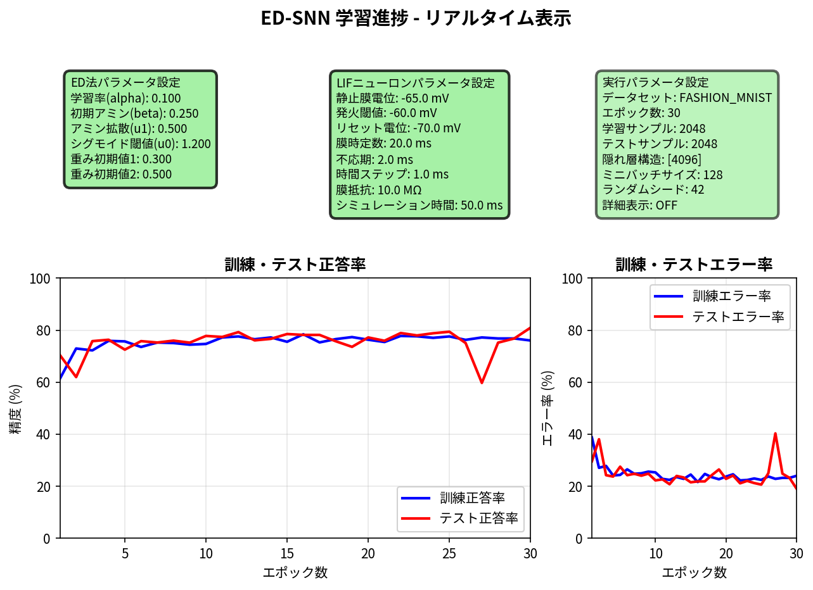
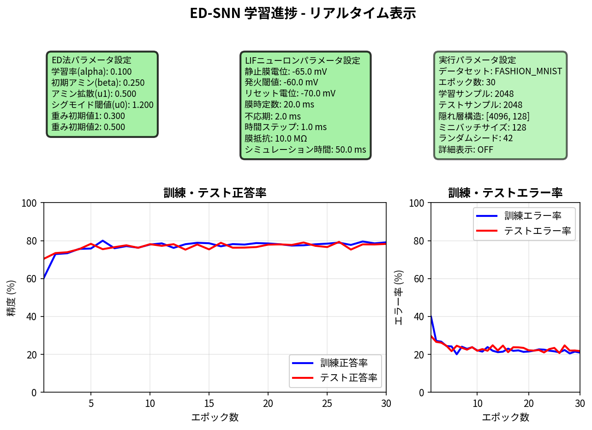
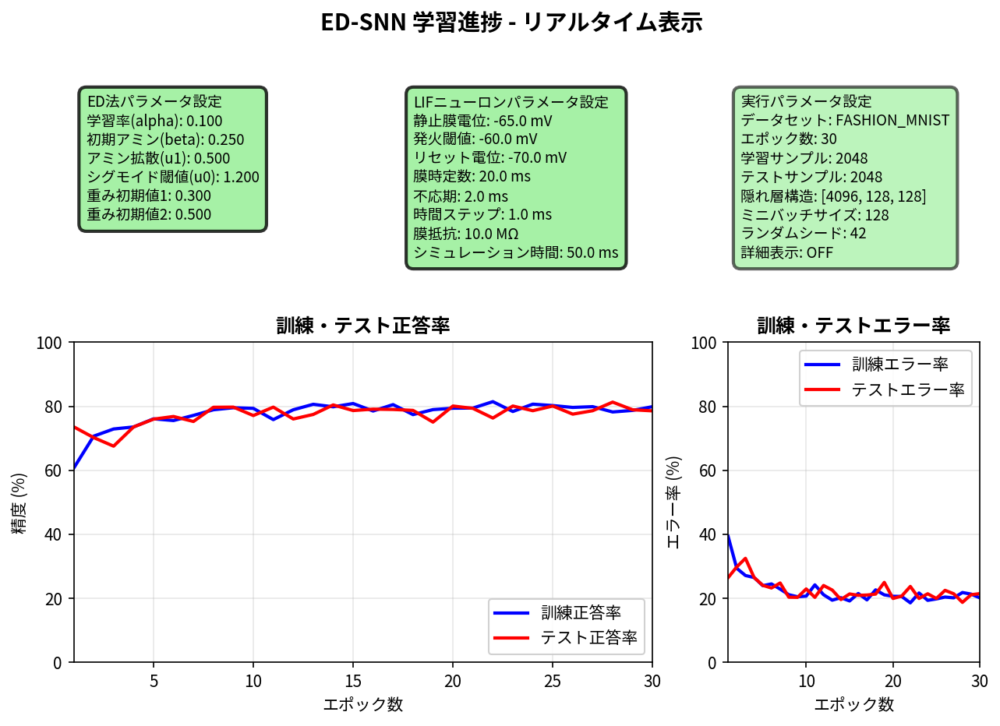
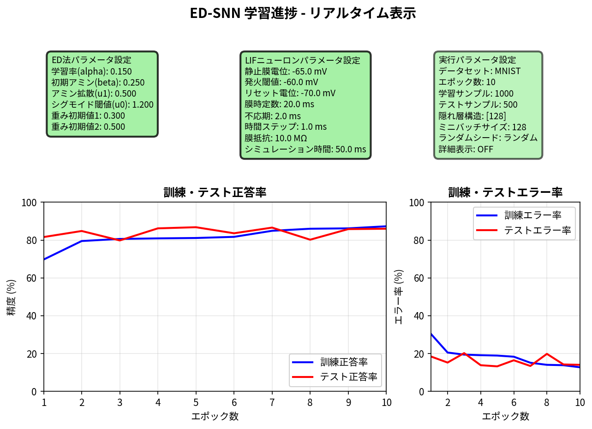
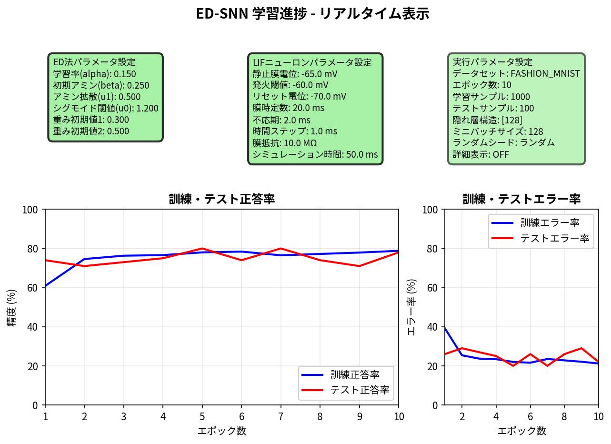

## 1.python ed_multi_lif_snn.py --viz --heatmap --fashion --epochs 10 --save_fig viz_results_for_public/lif_snn_hid1024_epo10 --hidden 1024

【ED法アルゴリズムパラメータ】 
  学習率 (alpha):         0.100 
  初期アミン濃度 (beta):  0.250 
  アミン拡散係数 (u1):    0.500 
  シグモイド閾値 (u0):    1.200 
  重み初期値1:            0.300 
  重み初期値2:            0.500 
 
【LIFニューロンパラメータ】 
  静止膜電位 (v_rest):    -65.0 mV 
  発火閾値 (v_threshold): -60.0 mV 
  リセット電位 (v_reset): -70.0 mV 
  膜時定数 (tau_m):       20.0 ms 
  不応期 (tau_ref):       2.0 ms 
  時間ステップ (dt):      1.0 ms 
  膜抵抗 (R_m):           10.0 MΩ 
  シミュレーション時間:   50.0 ms 
  LIF層使用:              無効 
 
【実行時設定パラメータ】 
  データセット:           Fashion-MNIST 
  訓練データ数:           512 
  テストデータ数:         512 
  エポック数:             10 
  隠れ層構造:             1024 (単層) 
  ミニバッチサイズ:       128 (ミニバッチ) 
  ランダムシード:         ランダム 
  データシャッフル:       ON 
  リアルタイム可視化:     ON 
  詳細表示:               OFF 

✅ 最終結果: 
   学習精度: 73.05% 
   テスト正答率: 76.37% 

## 2.python ed_multi_lif_snn.py --viz --heatmap --fashion --epochs 10 --save_fig viz_results_for_public/lif_snn_hid1024_epo10 --hidden 2048

【ED法アルゴリズムパラメータ】 
  学習率 (alpha):         0.100 
  初期アミン濃度 (beta):  0.250 
  アミン拡散係数 (u1):    0.500 
  シグモイド閾値 (u0):    1.200 
  重み初期値1:            0.300 
  重み初期値2:            0.500 
 
【LIFニューロンパラメータ】 
  静止膜電位 (v_rest):    -65.0 mV 
  発火閾値 (v_threshold): -60.0 mV 
  リセット電位 (v_reset): -70.0 mV 
  膜時定数 (tau_m):       20.0 ms 
  不応期 (tau_ref):       2.0 ms 
  時間ステップ (dt):      1.0 ms 
  膜抵抗 (R_m):           10.0 MΩ 
  シミュレーション時間:   50.0 ms 
  LIF層使用:              無効 
 
【実行時設定パラメータ】 
  データセット:           Fashion-MNIST 
  訓練データ数:           512 
  テストデータ数:         512 
  エポック数:             10 
  隠れ層構造:             2048 (単層) 
  ミニバッチサイズ:       128 (ミニバッチ) 
  ランダムシード:         ランダム 
  データシャッフル:       ON 
  リアルタイム可視化:     ON 
  詳細表示:               OFF 

✅ 最終結果: 
   学習精度: 78.52% 
   テスト正答率: 72.07% 

## 3.python ed_multi_lif_snn.py --viz --heatmap --fashion --seed 42 --train 2048 --test 2048 --batch 128 --save_fig viz_results_for_public/lif_snn_fashion_hid4096_epo30 --hidden 4096 --epochs 30

【ED法アルゴリズムパラメータ】 
  学習率 (alpha):         0.100 
  初期アミン濃度 (beta):  0.250 
  アミン拡散係数 (u1):    0.500 
  シグモイド閾値 (u0):    1.200 
  重み初期値1:            0.300 
  重み初期値2:            0.500 
 
【LIFニューロンパラメータ】 
  静止膜電位 (v_rest):    -65.0 mV 
  発火閾値 (v_threshold): -60.0 mV 
  リセット電位 (v_reset): -70.0 mV 
  膜時定数 (tau_m):       20.0 ms 
  不応期 (tau_ref):       2.0 ms 
  時間ステップ (dt):      1.0 ms 
  膜抵抗 (R_m):           10.0 MΩ 
  シミュレーション時間:   50.0 ms 
  LIF層使用:              無効 
 
【実行時設定パラメータ】 
  データセット:           Fashion-MNIST 
  訓練データ数:           2048 
  テストデータ数:         2048 
  エポック数:             30 
  隠れ層構造:             4096 (単層) 
  ミニバッチサイズ:       128 (ミニバッチ) 
  ランダムシード:         42 
  データシャッフル:       ON 
  リアルタイム可視化:     ON 
  詳細表示:               OFF 

100%|█████████████| 30/30 [4:17:48<00:00, 515.63s/epoch, 訓精=76.0%, テ精=81.0%, 訓エ=24.0%, テエ=19.0%]
 
✅ 最終結果: 
   学習精度: 76.03% 
   テスト正答率: 78.12% 

## 4.python ed_multi_lif_snn.py --viz --heatmap --fashion --seed 42 --train 2048 --test 2048 --batch 128 --save_fig viz_results_for_public/lif_snn_fashion_hid4096_epo30 --hidden 4096,128 --epochs 30

【ED法アルゴリズムパラメータ】 
  学習率 (alpha):         0.100 
  初期アミン濃度 (beta):  0.250 
  アミン拡散係数 (u1):    0.500 
  シグモイド閾値 (u0):    1.200 
  重み初期値1:            0.300 
  重み初期値2:            0.500 
 
【LIFニューロンパラメータ】 
  静止膜電位 (v_rest):    -65.0 mV 
  発火閾値 (v_threshold): -60.0 mV 
  リセット電位 (v_reset): -70.0 mV 
  膜時定数 (tau_m):       20.0 ms 
  不応期 (tau_ref):       2.0 ms 
  時間ステップ (dt):      1.0 ms 
  膜抵抗 (R_m):           10.0 MΩ 
  シミュレーション時間:   50.0 ms 
  LIF層使用:              無効 
 
【実行時設定パラメータ】 
  データセット:           Fashion-MNIST 
  訓練データ数:           2048 
  テストデータ数:         2048 
  エポック数:             30 
  隠れ層構造:             4096,128 (多層) 
  ミニバッチサイズ:       128 (ミニバッチ) 
  ランダムシード:         42 
  データシャッフル:       ON 
  リアルタイム可視化:     ON 
  詳細表示:               OFF 

100%|█████████████| 30/30 [4:46:53<00:00, 573.79s/epoch, 訓精=79.1%, テ精=78.3%, 訓エ=20.9%, テエ=21.7%]
 
✅ 最終結果: 
   学習精度: 79.10% 
   テスト正答率: 80.62% 

## 5.python ed_multi_lif_snn.py --viz --heatmap --fashion --seed 42 --train 2048 --test 2048 --batch 128 --save_fig viz_results_for_public/lif_snn_fashion_hid4096_128_64_epo30 --hidden 4096,128,64 --epochs 30

【ED法アルゴリズムパラメータ】 
  学習率 (alpha):         0.100 
  初期アミン濃度 (beta):  0.250 
  アミン拡散係数 (u1):    0.500 
  シグモイド閾値 (u0):    1.200 
  重み初期値1:            0.300 
  重み初期値2:            0.500 
 
【LIFニューロンパラメータ】 
  静止膜電位 (v_rest):    -65.0 mV 
  発火閾値 (v_threshold): -60.0 mV 
  リセット電位 (v_reset): -70.0 mV 
  膜時定数 (tau_m):       20.0 ms 
  不応期 (tau_ref):       2.0 ms 
  時間ステップ (dt):      1.0 ms 
  膜抵抗 (R_m):           10.0 MΩ 
  シミュレーション時間:   50.0 ms 
  LIF層使用:              無効 
 
【実行時設定パラメータ】 
  データセット:           Fashion-MNIST 
  訓練データ数:           2048 
  テストデータ数:         2048 
  エポック数:             30 
  隠れ層構造:             4096,128,64 (多層) 
  ミニバッチサイズ:       128 (ミニバッチ) 
  ランダムシード:         42 
  データシャッフル:       ON 
  リアルタイム可視化:     ON 
  詳細表示:               OFF 

100%|█████████████| 30/30 [5:04:17<00:00, 608.60s/epoch, 訓精=81.2%, テ精=78.3%, 訓エ=18.8%, テエ=21.7%]
 
✅ 最終結果: 
   学習精度: 81.25% 
   テスト正答率: 79.44% 

## 6.python ed_multi_lif_snn.py --viz --heatmap --fashion --seed 42 --train 2048 --test 2048 --batch 128 --save_fig viz_results_for_public/lif_snn_fashion_hid4096_epo30 --hidden 4096,128,128 --epochs 30

【ED法アルゴリズムパラメータ】 
  学習率 (alpha):         0.100 
  初期アミン濃度 (beta):  0.250 
  アミン拡散係数 (u1):    0.500 
  シグモイド閾値 (u0):    1.200 
  重み初期値1:            0.300 
  重み初期値2:            0.500 
 
【LIFニューロンパラメータ】 
  静止膜電位 (v_rest):    -65.0 mV 
  発火閾値 (v_threshold): -60.0 mV 
  リセット電位 (v_reset): -70.0 mV 
  膜時定数 (tau_m):       20.0 ms 
  不応期 (tau_ref):       2.0 ms 
  時間ステップ (dt):      1.0 ms 
  膜抵抗 (R_m):           10.0 MΩ 
  シミュレーション時間:   50.0 ms 
  LIF層使用:              無効 
 
【実行時設定パラメータ】 
  データセット:           Fashion-MNIST 
  訓練データ数:           2048 
  テストデータ数:         2048 
  エポック数:             30 
  隠れ層構造:             4096,128,128 (多層) 
  ミニバッチサイズ:       128 (ミニバッチ) 
  ランダムシード:         42 
  データシャッフル:       ON 
  リアルタイム可視化:     ON 
  詳細表示:               OFF 

100%|█████████████| 30/30 [5:29:54<00:00, 659.82s/epoch, 訓精=79.9%, テ精=78.6%, 訓エ=20.1%, テエ=21.4%]
 
✅ 最終結果: 
   学習精度: 79.88% 
   テスト正答率: 78.96% 

## 7.python ed_multi_lif_snn.py --viz --heatmap --fashion --seed 42 --train 4096 --test 4096 --batch 128 --save_fig viz_results_for_public/lif_snn_fashion_hid4096_epo30 --hidden 4096,128 --epochs 30

【ED法アルゴリズムパラメータ】 
  学習率 (alpha):         0.100 
  初期アミン濃度 (beta):  0.250 
  アミン拡散係数 (u1):    0.500 
  シグモイド閾値 (u0):    1.200 
  重み初期値1:            0.300 
  重み初期値2:            0.500 
 
【LIFニューロンパラメータ】 
  静止膜電位 (v_rest):    -65.0 mV 
  発火閾値 (v_threshold): -60.0 mV 
  リセット電位 (v_reset): -70.0 mV 
  膜時定数 (tau_m):       20.0 ms 
  不応期 (tau_ref):       2.0 ms 
  時間ステップ (dt):      1.0 ms 
  膜抵抗 (R_m):           10.0 MΩ 
  シミュレーション時間:   50.0 ms 
  LIF層使用:              無効 
 
【実行時設定パラメータ】 
  データセット:           Fashion-MNIST 
  訓練データ数:           4096 
  テストデータ数:         4096 
  エポック数:             30 
  隠れ層構造:             4096,128 (多層) 
  ミニバッチサイズ:       128 (ミニバッチ) 
  ランダムシード:         42 
  データシャッフル:       ON 
  リアルタイム可視化:     ON 
  詳細表示:               OFF 

100%|█████████████| 30/30 [9:32:17<00:00, 1144.60s/epoch, 訓精=76.6%, テ精=75.3%, 訓エ=23.4%, テエ=24.7%]
 
✅ 最終結果: 
   学習精度: 76.59% 
   テスト正答率: 75.05% 

## 8.python ed_multi_lif_snn.py --viz --heatmap --fashion --seed 42 --train 4096 --test 4096 --batch 128 --save_fig viz_results_for_public/lif_snn_fashion_hid4096_epo30 --hidden 4096,128,128 --epochs 30

【ED法アルゴリズムパラメータ】 
  学習率 (alpha):         0.100 
  初期アミン濃度 (beta):  0.250 
  アミン拡散係数 (u1):    0.500 
  シグモイド閾値 (u0):    1.200 
  重み初期値1:            0.300 
  重み初期値2:            0.500 
 
【LIFニューロンパラメータ】 
  静止膜電位 (v_rest):    -65.0 mV 
  発火閾値 (v_threshold): -60.0 mV 
  リセット電位 (v_reset): -70.0 mV 
  膜時定数 (tau_m):       20.0 ms 
  不応期 (tau_ref):       2.0 ms 
  時間ステップ (dt):      1.0 ms 
  膜抵抗 (R_m):           10.0 MΩ 
  シミュレーション時間:   50.0 ms 
  LIF層使用:              無効 
 
【実行時設定パラメータ】 
  データセット:           Fashion-MNIST 
  訓練データ数:           4096 
  テストデータ数:         4096 
  エポック数:             30 
  隠れ層構造:             4096,128,128 (多層) 
  ミニバッチサイズ:       128 (ミニバッチ) 
  ランダムシード:         42 
  データシャッフル:       ON 
  リアルタイム可視化:     ON 
  詳細表示:               OFF 

100%|█████████████| 30/30 [10:15:48<00:00, 1231.62s/epoch, 訓精=81.3%, テ精=80.8%, 訓エ=18.7%, テエ=19.2%]
 
✅ 最終結果: 
   学習精度: 81.27% 
   テスト正答率: 80.83% 

## 9.python ed_multi_lif_snn.py --viz --heatmap --fashion --seed 42 --train 2048 --test 2048 --batch 128 --save_fig viz_results_for_public/lif_snn_fashion_hid4096_128_epo20 --hidden 4096,128 --epochs 20 --lr 0.2

【ED法アルゴリズムパラメータ】 
  学習率 (alpha):         0.200 
  初期アミン濃度 (beta):  0.250 
  アミン拡散係数 (u1):    0.500 
  シグモイド閾値 (u0):    1.200 
  重み初期値1:            0.300 
  重み初期値2:            0.500 
 
【LIFニューロンパラメータ】 
  静止膜電位 (v_rest):    -65.0 mV 
  発火閾値 (v_threshold): -60.0 mV 
  リセット電位 (v_reset): -70.0 mV 
  膜時定数 (tau_m):       20.0 ms 
  不応期 (tau_ref):       2.0 ms 
  時間ステップ (dt):      1.0 ms 
  膜抵抗 (R_m):           10.0 MΩ 
  シミュレーション時間:   50.0 ms 
  LIF層使用:              無効 
 
【実行時設定パラメータ】 
  データセット:           Fashion-MNIST 
  訓練データ数:           2048 
  テストデータ数:         2048 
  エポック数:             20 
  隠れ層構造:             4096,128 (多層) 
  ミニバッチサイズ:       128 (ミニバッチ) 
  ランダムシード:         42 
  データシャッフル:       ON 
  リアルタイム可視化:     ON 
  詳細表示:               OFF 

100%|█████████████| 20/20 [3:19:18<00:00, 597.94s/epoch, 訓精=78.7%, テ精=77.0%, 訓エ=21.3%, テエ=23.0%]
 
✅ 最終結果: 
   学習精度: 78.71% 
   テスト正答率: 75.34% 

## 10.python ed_multi_lif_snn.py --viz --heatmap --fashion --seed 42 --train 2048 --test 2048 --batch 128 --save_fig viz_results_for_public/lif_snn_fashion_hid4096_128_epo20 --hidden 4096,128 --epochs 20 --ami 0.5

【ED法アルゴリズムパラメータ】 
  学習率 (alpha):         0.100 
  初期アミン濃度 (beta):  0.500 
  アミン拡散係数 (u1):    0.500 
  シグモイド閾値 (u0):    1.200 
  重み初期値1:            0.300 
  重み初期値2:            0.500 
 
【LIFニューロンパラメータ】 
  静止膜電位 (v_rest):    -65.0 mV 
  発火閾値 (v_threshold): -60.0 mV 
  リセット電位 (v_reset): -70.0 mV 
  膜時定数 (tau_m):       20.0 ms 
  不応期 (tau_ref):       2.0 ms 
  時間ステップ (dt):      1.0 ms 
  膜抵抗 (R_m):           10.0 MΩ 
  シミュレーション時間:   50.0 ms 
  LIF層使用:              無効 
 
【実行時設定パラメータ】 
  データセット:           Fashion-MNIST 
  訓練データ数:           2048 
  テストデータ数:         2048 
  エポック数:             20 
  隠れ層構造:             4096,128 (多層) 
  ミニバッチサイズ:       128 (ミニバッチ) 
  ランダムシード:         42 
  データシャッフル:       ON 
  リアルタイム可視化:     ON 
  詳細表示:               OFF 

100%|█████████████| 20/20 [3:20:02<00:00, 600.15s/epoch, 訓精=79.0%, テ精=79.2%, 訓エ=21.0%, テエ=20.8%]
 
✅ 最終結果: 
   学習精度: 78.96% 
   テスト正答率: 78.12% 

## 11.python ed_multi_lif_snn.py --viz --heatmap --fashion --seed 42 --train 2048 --test 2048 --batch 128 --save_fig viz_results_for_public/lif_snn_fashion_hid4096_128_epo20 --hidden 4096,128 --epochs 20 --dif 1.0

【ED法アルゴリズムパラメータ】 
  学習率 (alpha):         0.100 
  初期アミン濃度 (beta):  0.250 
  アミン拡散係数 (u1):    1.000 
  シグモイド閾値 (u0):    1.200 
  重み初期値1:            0.300 
  重み初期値2:            0.500 
 
【LIFニューロンパラメータ】 
  静止膜電位 (v_rest):    -65.0 mV 
  発火閾値 (v_threshold): -60.0 mV 
  リセット電位 (v_reset): -70.0 mV 
  膜時定数 (tau_m):       20.0 ms 
  不応期 (tau_ref):       2.0 ms 
  時間ステップ (dt):      1.0 ms 
  膜抵抗 (R_m):           10.0 MΩ 
  シミュレーション時間:   50.0 ms 
  LIF層使用:              無効 
 
【実行時設定パラメータ】 
  データセット:           Fashion-MNIST 
  訓練データ数:           2048 
  テストデータ数:         2048 
  エポック数:             20 
  隠れ層構造:             4096,128 (多層) 
  ミニバッチサイズ:       128 (ミニバッチ) 
  ランダムシード:         42 
  データシャッフル:       ON 
  リアルタイム可視化:     ON 
  詳細表示:               OFF 

100%|█████████████| 20/20 [3:18:32<00:00, 595.60s/epoch, 訓精=78.9%, テ精=78.0%, 訓エ=21.1%, テエ=22.0%]
 
✅ 最終結果: 
   学習精度: 78.86% 
   テスト正答率: 76.61% 

## 12.python ed_multi_frelu_snn_backup.py --viz --heatmap --fashion --seed 42 --train 2048 --test 2048 --batch 128 --save_fig viz_results_for_public/frelu_snn_fashion_hid4096_128_epo20 --hidden 4096,128 --epochs 20 --dif 1.0

【ED法アルゴリズムパラメータ】 
  学習率 (alpha):         0.100 
  初期アミン濃度 (beta):  0.250 
  アミン拡散係数 (u1):    1.000 
  シグモイド閾値 (u0):    1.200 
  重み初期値1:            0.300 
  重み初期値2:            0.500 
 
【LIFニューロンパラメータ】 
  静止膜電位 (v_rest):    -65.0 mV 
  発火閾値 (v_threshold): -60.0 mV 
  リセット電位 (v_reset): -70.0 mV 
  膜時定数 (tau_m):       20.0 ms 
  不応期 (tau_ref):       2.0 ms 
  時間ステップ (dt):      1.0 ms 
  膜抵抗 (R_m):           10.0 MΩ 
  シミュレーション時間:   50.0 ms 
  LIF層使用:              入力層のみ (SNN) 
    - 入力層:             LIF + スパイク符号化 
    - 隠れ層・出力層:     FReLU活性化関数 (論文準拠) 
  FReLU仕様:              Funnel Activation (最適化版) 
    - 閾値パラメータ:     α=0.15 (69.6%実績ベース) 
    - Dale's Principle:   興奮性/抑制性ニューロン対応 
    - 数値安定性:         シグモイドスムージング適用 
    - 非線形関数:         max(x, αx) / min(x, -α|x|) 
  計算効率:               LIF比約10-50倍高速化 
  スパイク符号化方式:     poisson 
  スパイク最大発火率:     100.0 Hz 
  スパイクシミュレーション時間: 50.0 ms 
  スパイク時間ステップ:   1.0 ms 
 
【実行時設定パラメータ】
  データセット:           Fashion-MNIST 
  訓練データ数:           2048 
  テストデータ数:         2048 
  エポック数:             20 
  隠れ層構造:             4096,128 (多層) 
  ミニバッチサイズ:       128 (ミニバッチ) 
  ランダムシード:         42 
  データシャッフル:       ON 
  リアルタイム可視化:     ON 
  詳細表示:               OFF 

## 13.python ed_multi_lif_snn.py --viz --heatmap --fashion --seed 42 --train 2048 --test 2048 --batch 128 --save_fig viz_results_for_public/lif_snn_fashion_hid2048_1024_epo20_ami1.0_dif1.0 --hidden 2048,1024 --epochs 20 --ami 1.0 --dif 1.0

【ED法アルゴリズムパラメータ】 
  学習率 (alpha):         0.100 
  初期アミン濃度 (beta):  1.000 
  アミン拡散係数 (u1):    1.000 
  シグモイド閾値 (u0):    1.200 
  重み初期値1:            0.300 
  重み初期値2:            0.500 
 
【LIFニューロンパラメータ】 
  静止膜電位 (v_rest):    -65.0 mV 
  発火閾値 (v_threshold): -60.0 mV 
  リセット電位 (v_reset): -70.0 mV 
  膜時定数 (tau_m):       20.0 ms 
  不応期 (tau_ref):       2.0 ms 
  時間ステップ (dt):      1.0 ms 
  膜抵抗 (R_m):           10.0 MΩ 
  シミュレーション時間:   50.0 ms 
  LIF層使用:              有効 (全層LIF化) 
    - 入力層:             LIF + スパイク符号化 
    - 隠れ層・出力層:     LIF活性化関数 
  スパイク符号化方式:     poisson 
  スパイク最大発火率:     100.0 Hz 
  スパイクシミュレーション時間: 50.0 ms 
  スパイク時間ステップ:   1.0 ms 
 
【実行時設定パラメータ】 
  データセット:           Fashion-MNIST 
  訓練データ数:           2048 
  テストデータ数:         2048 
  エポック数:             20 
  隠れ層構造:             2048,1024 (多層) 
  ミニバッチサイズ:       128 (ミニバッチ) 
  ランダムシード:         42 
  データシャッフル:       ON 
  リアルタイム可視化:     ON 
  詳細表示:               OFF 

100%|█████████████| 20/20 [2:54:08<00:00, 522.44s/epoch, 訓精=74.4%, テ精=72.0%, 訓エ=25.6%, テエ=28.0%]
 
✅ 最終結果: 
   学習精度: 74.37% 
   テスト正答率: 70.61% 

## 14.python ed_multi_lif_snn.py --mnist --train 1000 --test 500 --spike_max_rate 150 --spike_sim_time 50 --spike_dt 1.0 --viz --heatmap --save_fig viz_results_for_public/lif_fashion_128_lr0.15_e10 --epochs 10 --hidden 128 --lr 0.15

【ED法アルゴリズムパラメータ】 
  学習率 (alpha):         0.150 
  初期アミン濃度 (beta):  0.250 
  アミン拡散係数 (u1):    0.500 
  シグモイド閾値 (u0):    1.200 
  重み初期値1:            0.300 
  重み初期値2:            0.500 
 
【LIFニューロンパラメータ】 
  静止膜電位 (v_rest):    -65.0 mV 
  発火閾値 (v_threshold): -60.0 mV 
  リセット電位 (v_reset): -70.0 mV 
  膜時定数 (tau_m):       20.0 ms 
  不応期 (tau_ref):       2.0 ms 
  時間ステップ (dt):      1.0 ms 
  膜抵抗 (R_m):           10.0 MΩ 
  シミュレーション時間:   50.0 ms 
  LIF層使用:              有効 (全層LIF化) 
    - 入力層:             LIF + スパイク符号化 
    - 隠れ層・出力層:     LIF活性化関数 
  スパイク符号化方式:     poisson 
  スパイク最大発火率:     150.0 Hz 
  スパイクシミュレーション時間: 50.0 ms 
  スパイク時間ステップ:   1.0 ms 
 
【実行時設定パラメータ】 
  データセット:           MNIST 
  訓練データ数:           1000 
  テストデータ数:         500 
  エポック数:             10 
  隠れ層構造:             128 (単層) 
  ミニバッチサイズ:       128 (ミニバッチ) 
  ランダムシード:         ランダム 
  データシャッフル:       ON 
  リアルタイム可視化:     ON 
  詳細表示:               OFF 

100%|█████████████| 10/10 [26:20<00:00, 158.02s/epoch, 訓精=87.3%, テ精=86.0%, 訓エ=12.7%, テエ=14.0%]
 
✅ 最終結果: 
   学習精度: 87.30% 
   テスト正答率: 87.20% 

## 15.python ed_multi_lif_snn.py --fashion --train 1000 --test 100 --spike_max_rate 150 --spike_sim_time 50 --spike_dt 1.0 --viz --heatmap --save_fig viz_results_for_public/lif_fashion_128_lr0.15_e10 --epochs 10 --hidden 128 --lr 0.15

【ED法アルゴリズムパラメータ】 
  学習率 (alpha):         0.150 
  初期アミン濃度 (beta):  0.250 
  アミン拡散係数 (u1):    0.500 
  シグモイド閾値 (u0):    1.200 
  重み初期値1:            0.300 
  重み初期値2:            0.500 
 
【LIFニューロンパラメータ】 
  静止膜電位 (v_rest):    -65.0 mV 
  発火閾値 (v_threshold): -60.0 mV 
  リセット電位 (v_reset): -70.0 mV 
  膜時定数 (tau_m):       20.0 ms 
  不応期 (tau_ref):       2.0 ms 
  時間ステップ (dt):      1.0 ms 
  膜抵抗 (R_m):           10.0 MΩ 
  シミュレーション時間:   50.0 ms 
  LIF層使用:              有効 (全層LIF化) 
    - 入力層:             LIF + スパイク符号化 
    - 隠れ層・出力層:     LIF活性化関数 
  スパイク符号化方式:     poisson 
  スパイク最大発火率:     150.0 Hz 
  スパイクシミュレーション時間: 50.0 ms 
  スパイク時間ステップ:   1.0 ms 
 
【実行時設定パラメータ】 
  データセット:           Fashion-MNIST 
  訓練データ数:           1000 
  テストデータ数:         100 
  エポック数:             10 
  隠れ層構造:             128 (単層) 
  ミニバッチサイズ:       128 (ミニバッチ) 
  ランダムシード:         ランダム 
  データシャッフル:       ON 
  リアルタイム可視化:     ON 
  詳細表示:               OFF 

100%|█████████████| 10/10 [20:46<00:00, 124.63s/epoch, 訓精=78.8%, テ精=78.0%, 訓エ=21.2%, テエ=22.0%]
 
✅ 最終結果: 
   学習精度: 78.80% 
   テスト正答率: 83.00% 

## 16.python ed_multi_lif_snn.py --mnist --train 1000 --test 500 --spike_max_rate 150 --spike_sim_time 50 --spike_dt 1.0 --viz --heatmap --save_fig viz_results_for_public/lif_mnist_256_lr0.15_e20 --epochs 20 --hidden 256 --lr 0.15

【ED法アルゴリズムパラメータ】 
  学習率 (alpha):         0.150 
  初期アミン濃度 (beta):  0.250 
  アミン拡散係数 (u1):    0.500 
  シグモイド閾値 (u0):    1.200 
  重み初期値1:            0.300 
  重み初期値2:            0.500 
 
【LIFニューロンパラメータ】 
  静止膜電位 (v_rest):    -65.0 mV 
  発火閾値 (v_threshold): -60.0 mV 
  リセット電位 (v_reset): -70.0 mV 
  膜時定数 (tau_m):       20.0 ms 
  不応期 (tau_ref):       2.0 ms 
  時間ステップ (dt):      1.0 ms 
  膜抵抗 (R_m):           10.0 MΩ 
  シミュレーション時間:   50.0 ms 
  LIF層使用:              有効 (全層LIF化) 
    - 入力層:             LIF + スパイク符号化 
    - 隠れ層・出力層:     LIF活性化関数 
  スパイク符号化方式:     poisson 
  スパイク最大発火率:     150.0 Hz 
  スパイクシミュレーション時間: 50.0 ms 
  スパイク時間ステップ:   1.0 ms 
 
【実行時設定パラメータ】 
  データセット:           MNIST 
  訓練データ数:           1000 
  テストデータ数:         500 
  エポック数:             20 
  隠れ層構造:             256 (単層) 
  ミニバッチサイズ:       128 (ミニバッチ) 
  ランダムシード:         ランダム 
  データシャッフル:       ON 
  リアルタイム可視化:     ON 
  詳細表示:               OFF 

100%|█████████████| 20/20 [52:09<00:00, 156.46s/epoch, 訓精=89.6%, テ精=89.2%, 訓エ=10.4%, テエ=10.8%]
 
✅ 最終結果: 
   学習精度: 89.60% 
   テスト正答率: 87.60% 

## 17.python ed_multi_lif_snn.py --fashion --train 1000 --test 500 --spike_max_rate 150 --spike_sim_time 50 --spike_dt 1.0 --viz --heatmap --save_fig viz_results_for_public/lif_fashion_256_lr0.15_e20 --epochs 20 --hidden 256 --lr 0.15

【ED法アルゴリズムパラメータ】 
  学習率 (alpha):         0.150 
  初期アミン濃度 (beta):  0.250 
  アミン拡散係数 (u1):    0.500 
  シグモイド閾値 (u0):    1.200 
  重み初期値1:            0.300 
  重み初期値2:            0.500 
 
【LIFニューロンパラメータ】 
  静止膜電位 (v_rest):    -65.0 mV 
  発火閾値 (v_threshold): -60.0 mV 
  リセット電位 (v_reset): -70.0 mV 
  膜時定数 (tau_m):       20.0 ms 
  不応期 (tau_ref):       2.0 ms 
  時間ステップ (dt):      1.0 ms 
  膜抵抗 (R_m):           10.0 MΩ 
  シミュレーション時間:   50.0 ms 
  LIF層使用:              有効 (全層LIF化) 
    - 入力層:             LIF + スパイク符号化 
    - 隠れ層・出力層:     LIF活性化関数 
  スパイク符号化方式:     poisson 
  スパイク最大発火率:     150.0 Hz 
  スパイクシミュレーション時間: 50.0 ms 
  スパイク時間ステップ:   1.0 ms 
 
【実行時設定パラメータ】 
  データセット:           Fashion-MNIST 
  訓練データ数:           1000 
  テストデータ数:         500 
  エポック数:             20 
  隠れ層構造:             256 (単層) 
  ミニバッチサイズ:       128 (ミニバッチ) 
  ランダムシード:         ランダム 
  データシャッフル:       ON 
  リアルタイム可視化:     ON 
  詳細表示:               OFF 

100%|█████████████| 20/20 [52:31<00:00, 157.57s/epoch, 訓精=78.0%, テ精=80.0%, 訓エ=22.0%, テエ=20.0%]
 
✅ 最終結果: 
   学習精度: 78.00% 
   テスト正答率: 78.20% 

## 18. python ed_multi_lif_snn.py --viz --heatmap --fashion --seed 42 --train 4096 --test 4096 --batch 128 --save_fig viz_results_for_public/lif_snn_fashion_hid4096_epo30 --hidden 4096,128,128 --epochs 30 --dif 2.0

【ED法アルゴリズムパラメータ】
  学習率 (alpha):         0.100
  初期アミン濃度 (beta):  0.250
  アミン拡散係数 (u1):    2.000
  シグモイド閾値 (u0):    1.200
  重み初期値1:            0.300
  重み初期値2:            0.500

【LIFニューロンパラメータ】
  静止膜電位 (v_rest):    -65.0 mV
  発火閾値 (v_threshold): -60.0 mV
  リセット電位 (v_reset): -70.0 mV
  膜時定数 (tau_m):       20.0 ms
  不応期 (tau_ref):       2.0 ms
  時間ステップ (dt):      1.0 ms
  膜抵抗 (R_m):           10.0 MΩ
  シミュレーション時間:   50.0 ms
  LIF層使用:              有効 (全層LIF化)
    - 入力層:             LIF + スパイク符号化
    - 隠れ層・出力層:     LIF活性化関数
  スパイク符号化方式:     poisson
  スパイク最大発火率:     100.0 Hz
  スパイクシミュレーション時間: 50.0 ms
  スパイク時間ステップ:   1.0 ms

【実行時設定パラメータ】
  データセット:           Fashion-MNIST
  訓練データ数:           4096
  テストデータ数:         4096
  エポック数:             30
  隠れ層構造:             4096,128,128 (多層)
  ミニバッチサイズ:       128 (ミニバッチ)
  ランダムシード:         42
  データシャッフル:       ON
  リアルタイム可視化:     ON
  詳細表示:               OFF
  図表保存:               ON -> viz_results_for_public/lif_snn_fashion_hid4096_epo30

